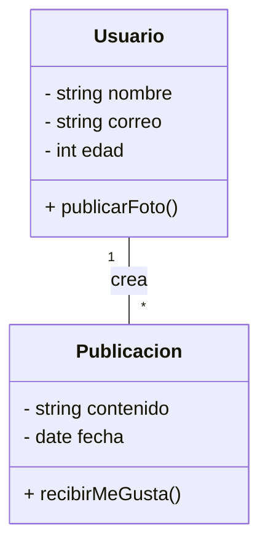
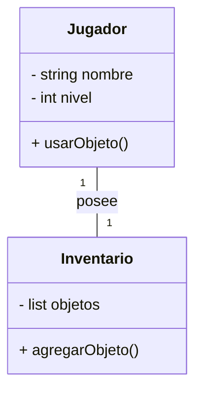
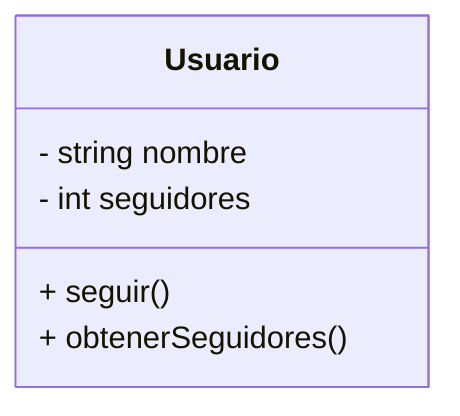
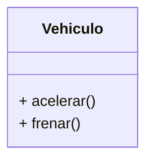
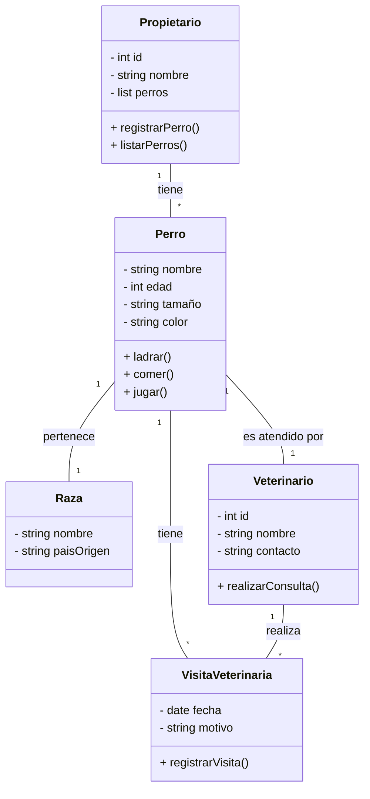
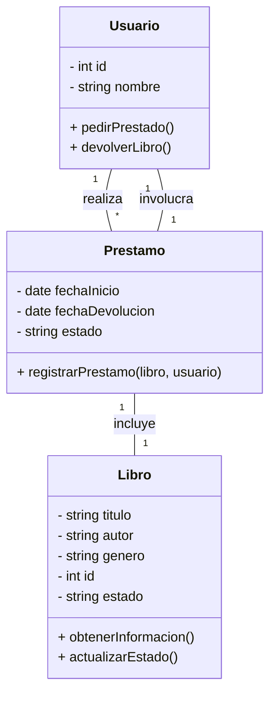
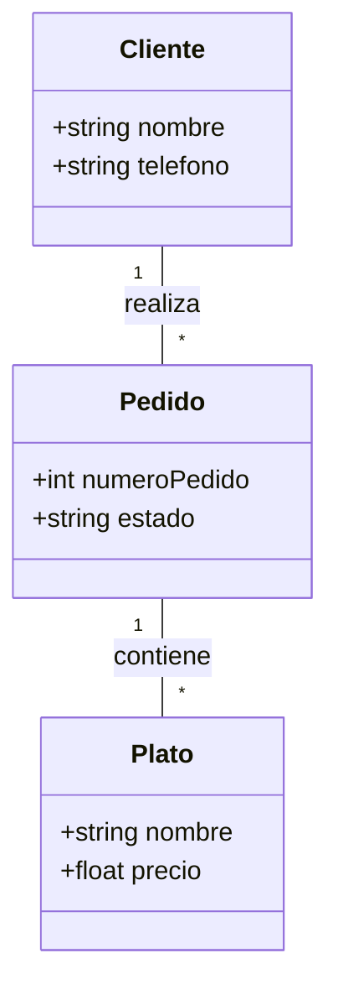
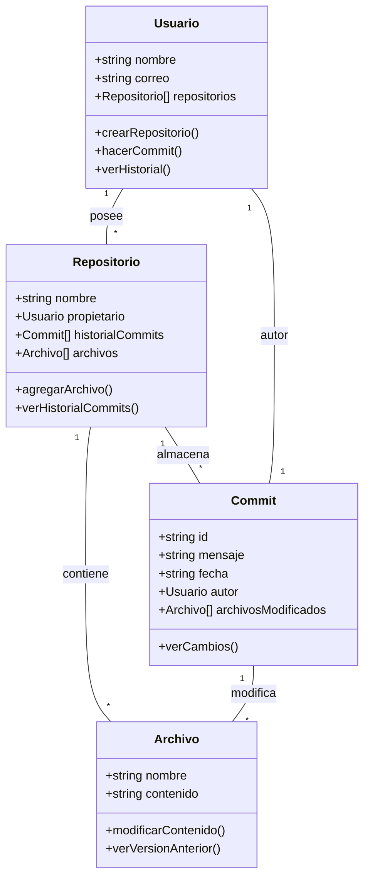

# Guía de Estudio: Diseño Orientado a Objetos en C++

## **1. Introducción**

### **1.1 Conectando GitHub con la Programación Orientada a Objetos**

Hasta ahora, has aprendido a usar Git y GitHub para gestionar versiones de código y colaborar en proyectos. Sin embargo, escribir código sin una estructura bien definida puede llevar a sistemas difíciles de mantener y escalar. El desarrollo de software no solo consiste en escribir código funcional, sino también en asegurarse de que ese código sea claro, modular y fácil de modificar en el futuro. Aquí es donde entra la **Programación Orientada a Objetos (POO)**: un enfoque que organiza el código en **clases y objetos**, facilitando su reutilización y mantenimiento.

La **reutilización del código** permite ahorrar tiempo y esfuerzo, evitando la necesidad de escribir las mismas funciones una y otra vez. Esto no solo optimiza el trabajo del programador, sino que también mejora la estabilidad y consistencia del software. Por otro lado, el **mantenimiento** es clave para la evolución de un sistema, ya que a medida que crecen los proyectos, es necesario actualizar funcionalidades, corregir errores y adaptarse a nuevos requisitos sin afectar otras partes del código.

Muchos sistemas empresariales y aplicaciones que usamos a diario han sido desarrollados con estos principios. Desde redes sociales hasta plataformas de comercio electrónico, la capacidad de reutilizar código y mantenerlo fácilmente es lo que permite que estos sistemas sean escalables y confiables a lo largo del tiempo.

### **1.2 Relación con el Mundo Real**

La POO se inspira en cómo interactuamos con el mundo real. Todo a nuestro alrededor está compuesto por **objetos** con características (atributos) y comportamientos (métodos). Por ejemplo, un **carro** tiene atributos como color, marca y modelo, y métodos como arrancar y frenar. Además, un **conductor** puede estar asociado a un carro, estableciendo una relación entre ambas clases.

Este mismo principio se aplica en la POO para modelar sistemas complejos. Por ejemplo, en el mundo de Minecraft, podemos tener una clase `Entidad` con atributos como `nombre` y `salud`, y subclases como `Jugador` y `Mob`. Un `Jugador` puede interactuar con diferentes `Bloques` del mundo, estableciendo una relación de asociación. Además, podríamos modelar una clase `Inventario` que contenga múltiples `Objeto`s, como herramientas o comida, que pueden ser usados por el `Jugador`. De esta manera, podemos estructurar el sistema de Minecraft de forma modular y reutilizable, facilitando la creación y mantenimiento del juego.

También podemos considerar una red social donde una clase `Usuario` tiene atributos como `nombre`, `correo` y `edad`, mientras que una clase `Publicación` almacena contenido generado por los usuarios. Aquí, cada `Usuario` puede estar asociado a múltiples `Publicaciones`, estableciendo una relación clara entre las entidades y permitiendo modelar interacciones como "me gusta" y comentarios.

Además, podemos agregar una clase `Comentario`, que representa las respuestas a una `Publicación`. La clase `Comentario` podría tener atributos como `autor`, `contenido` y `fecha`, y estar asociada tanto a un `Usuario` como a una `Publicación`, creando un modelo más detallado y realista de una red social.

Este enfoque permite modelar sistemas de software de manera más natural y comprensible, promoviendo la reutilización del código y facilitando la escalabilidad del sistema.

### **1.3 Origen e Importancia de la POO**

El paradigma de POO comenzó a tomar fuerza en la década de 1960 con el lenguaje **Simula**, diseñado para simulaciones. En los años 80, el lenguaje **Smalltalk** popularizó el concepto. Luego, lenguajes como C++, Java y Python adoptaron este enfoque, convirtiéndolo en el estándar para el desarrollo de software. Hoy en día, POO es fundamental en la industria del software, ya que permite crear sistemas escalables, modulares y fáciles de mantener.

#### **Ejemplos de sistemas que usan POO hoy en día**

La POO es ampliamente utilizada en una variedad de aplicaciones y sistemas, entre ellos:

- **Sistemas Operativos:** Windows, macOS y Linux utilizan POO para estructurar sus componentes en módulos reutilizables.
- **Videojuegos:** Motores gráficos como Unity y Unreal Engine se basan en POO para gestionar personajes, escenarios y físicas.
- **Aplicaciones Móviles:** Tanto Android como iOS implementan POO en sus frameworks de desarrollo (Java/Kotlin en Android, Swift/Objective-C en iOS).
- **Sistemas de Gestión Empresarial:** Software como SAP, Salesforce y ERP utilizan POO para modelar clientes, empleados y productos.
- **Redes Sociales:** Facebook, Instagram y Twitter emplean POO para gestionar usuarios, publicaciones y conexiones.
- **Aplicaciones Web:** Frameworks como Django (Python) y Spring (Java) usan POO para manejar la lógica de negocio y la interacción con bases de datos.

---

## **1.4 ¿Por qué es importante saber Programación Orientada a Objetos?**

Saber POO es fundamental para cualquier desarrollador, ya que:

- Facilita la organización y mantenimiento del código.
- Permite la reutilización de código a través de clases y herencia.
- Mejora la escalabilidad y modularidad de los sistemas.
- Es un estándar en la industria del software, usado en múltiples lenguajes y tecnologías.

### **Revisa el contexto: investigación sugerida**

Busca en plataformas como **LinkedIn**, **Glassdoor** o **Indeed** ofertas de empleo para desarrolladores de software que mencionen **Programación Orientada a Objetos (OOP/POO)**. También puedes consultar reportes de GitHub o Stack Overflow sobre tendencias en lenguajes de programación orientados a objetos.

✍ **Pregunta:** ¿Cuántas ofertas mencionan POO como requisito? ¿Qué lenguajes de programación orientados a objetos son los más solicitados?

---

## **2. Conceptos Clave**

### **2.1 Diagramas UML y Diagramas de Clases**

Un **diagrama UML (Unified Modeling Language)** es una representación gráfica utilizada para visualizar, especificar, construir y documentar los elementos de un sistema de software.

El **diagrama de clases** es uno de los diagramas UML más importantes, ya que muestra la estructura estática de un sistema al representar las clases, sus atributos, métodos y las relaciones entre ellas. En el contexto de la **Programación Orientada a Objetos (POO)**, estos diagramas ayudan a visualizar cómo las clases interactúan entre sí antes de implementarlas en código. Esto permite diseñar sistemas más organizados y escalables, facilitando la reutilización y mantenimiento del software. Gracias a los diagramas UML, los desarrolladores pueden entender la arquitectura del sistema sin necesidad de revisar el código en detalle, lo que mejora la colaboración en equipos de trabajo.

📌 **Ejemplo en UML:**

Este diagrama representa cómo un `Usuario` puede crear múltiples `Publicaciones`, estableciendo una relación clara entre ambas entidades. Para modelar mejor esta relación, se puede incluir una lista de publicaciones dentro de la clase `Usuario`, lo que indica que cada usuario tiene un conjunto de publicaciones asociadas. Esto permite gestionar de manera más efectiva las interacciones dentro del sistema y visualizar mejor cómo los objetos están conectados en una red social.

#### **Reglas para representar diagramas de clases:**

- **Las clases** se representan con un rectángulo dividido en tres secciones: nombre de la clase, atributos y métodos.
- **Los atributos** deben definirse con su tipo de dato (ejemplo: `nombre: string`).
- **Los métodos** deben incluir su tipo de retorno y parámetros si los tienen (ejemplo: `+ obtenerEdad(): int`).
- **Las relaciones** entre clases se representan con líneas:
  - **Asociación**: Línea simple entre clases, indica que una clase usa otra.
  - **Agregación**: Línea con un rombo vacío, indica que una clase contiene a otra, pero pueden existir de manera independiente. Este tipo de relación se estudiará en detalle más adelante en el curso, junto con otros conceptos avanzados como la agregación y la herencia, que permiten modelar sistemas de software de manera más estructurada y reutilizable.
  - **Composición**: Línea con un rombo lleno, indica que una clase no puede existir sin la otra. Este tipo de relación se estudiará en detalle más adelante en el curso, junto con otros conceptos avanzados como la agregación y la herencia, que permiten modelar sistemas de software de manera más estructurada y reutilizable.
  - **Herencia**: Flecha con triángulo, indica que una clase hereda atributos y métodos de otra. Este tipo de relación se estudiará en detalle más adelante en el curso, junto con otros conceptos avanzados como la agregación y la herencia, que permiten modelar sistemas de software de manera más estructurada y reutilizable.

### **2.1 Clases y Objetos**

Una **clase** es un molde o plantilla que define las características y comportamientos de un conjunto de objetos. Un **objeto** es una instancia específica de una clase, con valores concretos para sus atributos.

📌 **Ejemplo 1:** Imagina que estás programando un juego de carreras. La clase `Coche` define atributos como `marca`, `color` y `velocidadMáxima`, pero cada coche en la pista (un objeto) tendrá valores distintos para estos atributos. Un coche rojo con velocidad máxima de 200 km/h y otro azul con 220 km/h son diferentes objetos de la misma clase `Coche`.

📌 **Ejemplo 2:** En una red social, la clase `Usuario` define los atributos comunes a todos los usuarios, como `nombre`, `correo` y `edad`. Sin embargo, cada usuario en la plataforma es un objeto distinto con valores específicos, como `nombre: Juan`, `correo: juan@email.com`, `edad: 25`.

📌 **Ejemplo 3:** Piensa en una aplicación de música. La clase `Canción` puede definir atributos como `título`, `artista` y `duración`. Cada canción en la biblioteca es un objeto único basado en esta clase, con su propio título, artista y duración definidos.

### **2.2 Atributos y Métodos**

Los **atributos** y **métodos** son dos de los componentes esenciales de una clase. Comprender su diferencia es clave para diseñar correctamente un sistema orientado a objetos.

- **Atributos:** Representan las características o datos de un objeto. Son equivalentes a las variables dentro de una clase y almacenan información sobre el objeto.
- **Métodos:** Son las acciones que un objeto puede realizar. Definen su comportamiento y pueden modificar o utilizar sus atributos.

#### **¿Cómo diferenciar entre un atributo y una clase?**

A veces, es difícil decidir si un elemento del sistema debe ser un atributo dentro de una clase o si debe ser una clase independiente. Aquí hay algunos consejos para ayudar en esta decisión:

1. **Si el elemento tiene características propias, probablemente sea una clase.**

   - Ejemplo: En un sistema de gestión de estudiantes, `nombre` y `edad` son atributos de un `Estudiante`, pero `Dirección` podría ser una clase separada porque tiene varios datos como `calle`, `ciudad` y `código postal`.

2. **Si el elemento realiza acciones o tiene lógica propia, debe ser una clase.**

   - Ejemplo: En un juego, un `Jugador` puede tener un atributo `puntaje`, pero si el puntaje cambia según reglas específicas, podría ser mejor crear una clase `Puntaje`.

3. **Si el elemento solo describe una propiedad simple, es un atributo.**

   - Ejemplo: Un `Carro` puede tener atributos como `color`, `marca` y `velocidad`, pero un `Motor` podría ser una clase separada si tiene atributos y métodos propios como `potencia` y `encender()`.

4. **Si el elemento puede existir independientemente de la clase principal, probablemente sea una clase.**

   - Ejemplo: Un `Libro` en una biblioteca tiene un atributo `título`, pero un `Autor` debería ser una clase separada porque puede escribir varios libros y tener sus propias propiedades como `nombre` y `nacionalidad`.

📌 **Ejemplo:** Un `Usuario` en una red social puede tener atributos como `nombre` y `correo`, y métodos como `publicarFoto()` o `enviarMensaje()`. Si se decide modelar la `Foto` como una clase separada, es porque tiene características propias como `tamaño`, `formato` y `fechaDeSubida`.

### **2.3 Relaciones en POO**

Las **relaciones** en la Programación Orientada a Objetos (POO) son conexiones entre clases que permiten modelar la interacción entre distintos elementos de un sistema. Estas relaciones son esenciales para construir software estructurado y reutilizable, ya que reflejan cómo los objetos interactúan en el mundo real.

Existen varios tipos de relaciones, cada una con un propósito distinto:

- **Asociación:** Una relación en la que un objeto usa o interactúa con otro.
- **Agregación:** Una relación en la que una clase contiene a otra, pero ambos objetos pueden existir independientemente.
- **Composición:** Una relación en la que una clase contiene a otra, y la existencia del objeto secundario depende del objeto principal.
- **Herencia:** Una relación en la que una clase deriva de otra y hereda sus atributos y métodos.

Los conceptos de agregación, composición y herencia se estudiarán en detalle más adelante en el curso, pero por ahora nos centraremos en la asociación, que es una de las formas más comunes de relación en POO.

### **2.3.1 Relaciones de Asociación**

La **asociación** es una relación entre dos clases que permite que un objeto de una clase interactúe con un objeto de otra clase. Se utiliza para representar dependencias entre entidades dentro de un sistema.

📌 **Ejemplo:** En un videojuego como Minecraft, una clase `Jugador` puede estar asociada a una clase `Inventario`, donde cada `Jugador` tiene su propio `Inventario` que almacena objetos como herramientas y bloques.

Esta relación muestra que cada `Jugador` tiene exactamente un `Inventario`, y el `Inventario` solo pertenece a ese `Jugador`.

La **asociación** es una relación entre dos clases que permite que un objeto de una clase interactúe con un objeto de otra clase. Se utiliza para representar dependencias entre entidades dentro de un sistema.

📌 **Ejemplo:** En un videojuego como Minecraft, una clase `Jugador` puede estar asociada a una clase `Inventario`, donde cada `Jugador` tiene su propio `Inventario` que almacena objetos como herramientas y bloques.

Esta relación muestra que cada `Jugador` tiene exactamente un `Inventario`, y el `Inventario` solo pertenece a ese `Jugador`.

### **2.4 Encapsulamiento y Abstracción**

El **encapsulamiento** es uno de los pilares fundamentales de la Programación Orientada a Objetos (POO). Este principio ayuda a organizar y proteger la información dentro de un programa, asegurando que los datos no sean modificados de manera incorrecta o accidental.

En términos simples, el encapsulamiento significa que cada objeto controla su propia información y solo permite que otras partes del programa accedan o modifiquen ciertos datos de manera controlada.

📌 **Ejemplo en UML:**

Aquí, `nombre` y `seguidores` son atributos privados (representados con `-`), lo que significa que no pueden ser modificados directamente desde fuera de la clase. En cambio, las funciones `seguir()` y `obtenerSeguidores()` son públicas (representadas con `+`), lo que permite interactuar con los datos de una manera segura.

El encapsulamiento es clave para evitar errores y mejorar la seguridad de los programas, asegurando que cada clase solo exponga lo necesario para funcionar correctamente.

En UML, los modificadores de acceso se representan con los siguientes símbolos:

- `+` (público): El atributo o método es accesible desde cualquier parte del código.
- `-` (privado): Solo accesible dentro de la misma clase.
- `#` (protegido): Accesible dentro de la misma clase y sus subclases.

La **abstracción** es otro pilar fundamental de la POO. Se basa en simplificar los objetos del mundo real al enfocarse solo en sus características esenciales, ignorando los detalles innecesarios. Esto facilita la creación de modelos más claros y organizados en el software.

Un buen ejemplo de abstracción es un automóvil. Cuando conduces, no necesitas conocer todos los detalles mecánicos del motor para usarlo. Solo interactúas con lo esencial: el volante, los pedales y el tablero de control. En programación, ocurre lo mismo: definimos clases que ocultan la complejidad y solo exponen lo necesario para su uso.

📌 **Ejemplo en UML:**

Aquí, la clase `Vehiculo` solo expone los métodos esenciales `acelerar()` y `frenar()`, sin mostrar cómo están implementados internamente. Esto permite que otros desarrolladores usen la clase sin preocuparse por su funcionamiento interno.

## **3. Ejercicios de Diseño de Clases**

Para diseñar un sistema usando Programación Orientada a Objetos, es importante aprender a identificar qué elementos deben ser clases, atributos o métodos. A continuación, analizaremos un caso práctico paso a paso:

📌 **Enunciado:**

Estás desarrollando una aplicación para gestionar la información de perros y sus propietarios. El sistema maneja información sobre perros, sus propietarios, razas y veterinarios.

La aplicación debe gestionar la información de los perros, cada uno con un nombre único, una edad, un tamaño (grande, mediano, pequeño) y un color. Los perros también tienen una raza asociada, que incluye el nombre de la raza y su país de origen.

Los propietarios son personas registradas en el sistema con un número de identificación único y una lista de perros a su cargo. Cada propietario puede tener varios perros bajo su cuidado.

Para la gestión de la salud de los perros, cada perro tiene un veterinario asignado. Los veterinarios son profesionales registrados en el sistema con un número de identificación único y detalles de contacto.

Además, debe ser posible registrar las visitas al veterinario, incluyendo el perro que fue atendido, el veterinario que lo atendió, la fecha de la visita y el motivo de la visita. Un perro puede tener múltiples visitas al veterinario a lo largo del tiempo, pero cada visita específica corresponde a un solo perro atendido por un solo veterinario en una fecha específica.

### **Paso 1: Identificación de Clases**

Para definir las clases, debemos encontrar los sustantivos clave en la descripción del problema. Generalmente, los sustantivos representan entidades o conceptos del mundo real que deben modelarse en el sistema. Las clases identificadas representan elementos fundamentales que interactúan entre sí y contienen información relevante para la aplicación.

Las clases deben cumplir ciertos criterios:

- Representan entidades con identidad propia dentro del sistema.
- Contienen atributos que almacenan información relevante.
- Pueden tener métodos que definen acciones que pueden realizar.

En este caso, identificamos las siguientes clases:

- `Perro`
- `Propietario`
- `Raza`
- `Veterinario`
- `VisitaVeterinaria`

### **Paso 2: Definir Atributos**

Cada clase debe tener atributos que representen sus características esenciales:

- **Perro:** `nombre`, `edad`, `tamaño`, `color`, `raza`, `propietario`, `veterinario`
- **Propietario:** `id`, `nombre`, `listaDePerros`
- **Raza:** `nombre`, `paisOrigen`
- **Veterinario:** `id`, `nombre`, `contacto`
- **VisitaVeterinaria:** `perro`, `veterinario`, `fecha`, `motivo`

### **Paso 3: Definir Métodos**

Los métodos representan acciones que las clases pueden realizar:

- **Perro:** `ladrar()`, `comer()`, `jugar()`
- **Propietario:** `registrarPerro()`, `listarPerros()`
- **Veterinario:** `realizarConsulta()`
- **VisitaVeterinaria:** `registrarVisita()`

Este análisis nos ayuda a estructurar el sistema antes de representarlo gráficamente. Ahora definiremos las relaciones entre las clases:

- **Un Perro pertenece a un Propietario**, pero un Propietario puede tener varios Perros (Relación uno a muchos).
- **Un Perro tiene una Raza específica**, pero una Raza puede estar asociada a muchos Perros (Relación uno a muchos).
- **Un Perro tiene asignado un Veterinario**, pero un Veterinario puede atender a muchos Perros (Relación uno a muchos).
- **Cada VisitaVeterinaria está asociada a un solo Perro y un solo Veterinario**, pero un Perro puede tener múltiples VisitasVeterinarias con el tiempo (Relación muchos a uno).

Estas relaciones permiten modelar el comportamiento del sistema de manera más realista y ayudarán a construir un diagrama UML más preciso.

📌 **Diagrama UML del sistema:**

Este diagrama representa cómo las clases interactúan entre sí en el sistema. Cada `Propietario` puede tener varios `Perro`s, cada `Perro` pertenece a una `Raza`, y cada `Perro` tiene un `Veterinario` asignado. Además, se registran `VisitaVeterinaria`s, en las que un `Perro` es atendido por un `Veterinario` en una fecha específica.

### **Ejercicio 1: Práctica Independiente**

Ahora que has visto un ejemplo detallado, intenta aplicar lo aprendido a los siguientes enunciados. Para cada caso, identifica:

- Las clases que forman parte del sistema.
- Los atributos que deben tener esas clases.
- Los métodos necesarios para representar las acciones.
- Las relaciones entre las clases.

📌 **Enunciado:**

**Sistema de Gestión de Biblioteca:**  Se necesita desarrollar una aplicación para gestionar libros en una biblioteca. La biblioteca cuenta con un catálogo de libros, cada uno con un título, autor, género y un identificador único. Los usuarios pueden registrarse en el sistema con su nombre y un número de identificación único.&#x20;

1. Los usuarios pueden tomar libros prestados por un período determinado. Cada préstamo debe registrar la fecha de inicio, la fecha de devolución y el estado del libro (prestado o disponible). Un usuario puede tomar prestados varios libros a la vez, pero cada libro solo puede estar en posesión de un usuario a la vez.&#x20;
2. El sistema debe permitir las siguientes acciones:

   \- Registrar nuevos libros en la biblioteca.

   \- Registrar el préstamo de un libro a un usuario.

   \- Registrar la devolución de un libro y actualizar su estado.

   \- Mostrar la lista de libros disponibles y los que están prestados.

   \- Consultar el historial de préstamos de un usuario.

   El desafío consiste en identificar las clases necesarias, sus atributos y métodos, así como las relaciones entre ellas para finalmente hacer el diagrama UML

  
💡 **Ver solución paso a paso**

  ### **Solución Paso a Paso**

A continuación, resolveremos el ejercicio de gestión de biblioteca identificando clases, atributos, métodos y relaciones, y finalmente representándolo en un diagrama UML.

### **Paso 1: Identificación de Clases**

Para definir las clases, analizamos los sustantivos clave en la descripción del problema. En este caso, podemos identificar las siguientes clases:

- `Libro`
- `Usuario`
- `Prestamo`

### **Paso 2: Definir Atributos**
Cada clase debe contener atributos que representen sus características esenciales:

- **Libro**: `titulo`, `autor`, `genero`, `id`, `estado`
- **Usuario**: `id`, `nombre`
- **Prestamo**: `fechaInicio`, `fechaDevolucion`, `estado`, `libro`, `usuario`

### **Paso 3: Definir Métodos**
Los métodos representan acciones que las clases pueden realizar:

- **Libro**: `obtenerInformacion()`, `actualizarEstado()`
- **Usuario**: `pedirPrestado()`, `devolverLibro()`
- **Prestamo**: `registrarPrestamo(libro, usuario)`

### **Paso 4: Definir Relaciones**

- Un **Usuario** puede pedir prestados varios **Libros**.
- Un **Libro** solo puede estar en posesión de un único **Usuario** a la vez.
- Un **Prestamo** conecta un **Usuario** con un **Libro** y almacena la información sobre la fecha de préstamo y devolución.

### **Paso 5: Diagrama UML**

📌 **Diagrama UML del sistema:**

Este diagrama representa cómo las clases interactúan en el sistema. Cada `Usuario` puede tener múltiples `Prestamo`s, y cada `Prestamo` se asocia a un solo `Libro` y un solo `Usuario`.

  

### Ejercicio 2: Definir el Enunciado de un Problema a Partir de UML Diagrama : Sistema de Gestión de Pedidos en un Restaurante

**Instrucciones:**

- Interpreta el diagrama UML y redacta un enunciado que describa el sistema modelado.
- Explica las relaciones entre las clases y su importancia en el contexto del problema.
---

### Ejercicio 3: Modelando un Sistema de Control de Versiones

### Contexto

Un equipo de desarrollo utiliza Git y GitHub para gestionar el código fuente de sus proyectos. En este sistema, los desarrolladores necesitan poder almacenar sus proyectos, realizar cambios organizados y visualizar el historial de modificaciones.

### Objetivo

Representar mediante diagramas UML un sistema de control de versiones, identificando sus elementos fundamentales y sus relaciones.

### Descripción Detallada

El sistema de control de versiones permite a los desarrolladores organizar y gestionar los cambios en el código de un proyecto. Cada usuario representa a un programador que puede crear repositorios, modificar archivos y guardar cambios a lo largo del tiempo.

Cada **usuario** tiene un nombre y un correo electrónico y puede crear múltiples **repositorios**, que actúan como contenedores donde se almacenan los archivos del proyecto. Dentro de un repositorio, los desarrolladores pueden realizar modificaciones en los archivos y guardar estos cambios en lo que se conoce como un **commit**.

Un **commit** es una instantánea del estado del código en un momento específico. Contiene un identificador único, un mensaje descriptivo sobre los cambios realizados, la fecha en que se guardó y el usuario que lo hizo. A través de los commits, los programadores pueden visualizar el historial de modificaciones y revertir cambios si es necesario.

Además de commits, un repositorio puede contener otros elementos importantes como:

- **Archivos y directorios:** Son los elementos que almacenan el código fuente y la documentación del proyecto.
- **Historial de cambios:** Un registro que muestra el orden y detalle de los commits realizados en el repositorio.

### Instrucciones

1. Identificar las clases principales del sistema y definir sus atributos y métodos.
2. Determinar las relaciones entre estas clases y su jerarquía.
3. Crear un diagrama UML que represente la estructura del sistema.
4. Explicar en texto el funcionamiento del modelo y los roles de cada elemento.

### Entrega

Subir la documentación del análisis y los diagramas UML a un  archivo Markdown en el repositorio creado desde el GitHub Classroom.

  
💡 **Ver solución **

### Solución en UML

### **Recursos adicionales**

- [Editor de UML Mermaid](https://mermaid.live/edit)
- [GitHub Classroom](https://classroom.github.com)
