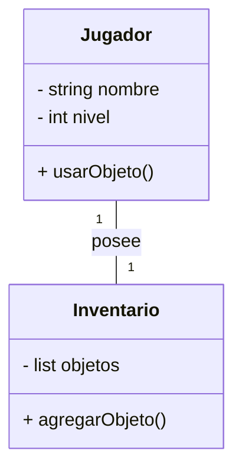
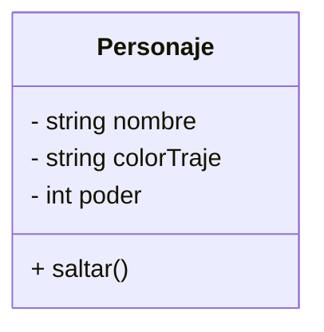
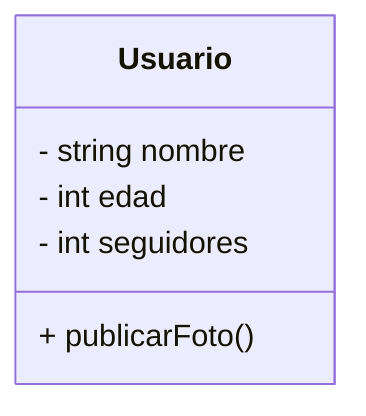
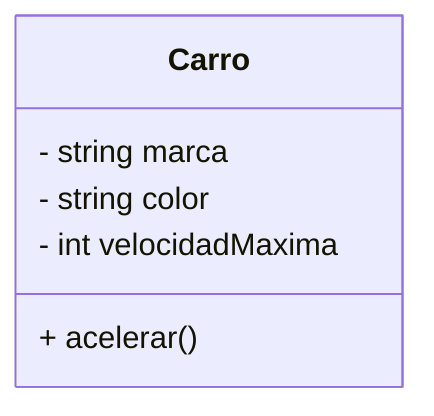

# Guía de Estudio: Diseño Orientado a Objetos en C++

## **1. Introducción**

### **1.1 Conectando GitHub con la Programación Orientada a Objetos**

Hasta ahora, has aprendido a usar Git y GitHub para gestionar versiones de código y colaborar en proyectos. Sin embargo, escribir código sin una estructura bien definida puede llevar a sistemas difíciles de mantener y escalar. El desarrollo de software no solo consiste en escribir código funcional, sino también en asegurarse de que ese código sea claro, modular y fácil de modificar en el futuro. Aquí es donde entra la **Programación Orientada a Objetos (POO)**: un enfoque que organiza el código en **clases y objetos**, facilitando su reutilización y mantenimiento.

La **reutilización del código** permite ahorrar tiempo y esfuerzo, evitando la necesidad de escribir las mismas funciones una y otra vez. Esto no solo optimiza el trabajo del programador, sino que también mejora la estabilidad y consistencia del software. Por otro lado, el **mantenimiento** es clave para la evolución de un sistema, ya que a medida que crecen los proyectos, es necesario actualizar funcionalidades, corregir errores y adaptarse a nuevos requisitos sin afectar otras partes del código.

Muchos sistemas empresariales y aplicaciones que usamos a diario han sido desarrollados con estos principios. Desde redes sociales hasta plataformas de comercio electrónico, la capacidad de reutilizar código y mantenerlo fácilmente es lo que permite que estos sistemas sean escalables y confiables a lo largo del tiempo.

### **1.2 Relación con el Mundo Real**

La POO se inspira en cómo interactuamos con el mundo real. Todo a nuestro alrededor está compuesto por **objetos** con características (atributos) y comportamientos (métodos). Por ejemplo, un **carro** tiene atributos como color, marca y modelo, y métodos como arrancar y frenar. Además, un **conductor** puede estar asociado a un carro, estableciendo una relación entre ambas clases.

Este mismo principio se aplica en la POO para modelar sistemas complejos. Por ejemplo, en el mundo de Minecraft, podemos tener una clase `Entidad` con atributos como `nombre` y `salud`, y subclases como `Jugador` y `Mob`. Un `Jugador` puede interactuar con diferentes `Bloques` del mundo, estableciendo una relación de asociación. Además, podríamos modelar una clase `Inventario` que contenga múltiples `Objeto`s, como herramientas o comida, que pueden ser usados por el `Jugador`. De esta manera, podemos estructurar el sistema de Minecraft de forma modular y reutilizable, facilitando la creación y mantenimiento del juego.

También podemos considerar una red social donde una clase `Usuario` tiene atributos como `nombre`, `correo` y `edad`, mientras que una clase `Publicación` almacena contenido generado por los usuarios. Aquí, cada `Usuario` puede estar asociado a múltiples `Publicaciones`, estableciendo una relación clara entre las entidades y permitiendo modelar interacciones como "me gusta" y comentarios.

Además, podemos agregar una clase `Comentario`, que representa las respuestas a una `Publicación`. La clase `Comentario` podría tener atributos como `autor`, `contenido` y `fecha`, y estar asociada tanto a un `Usuario` como a una `Publicación`, creando un modelo más detallado y realista de una red social.

Este enfoque permite modelar sistemas de software de manera más natural y comprensible, promoviendo la reutilización del código y facilitando la escalabilidad del sistema.

### **1.3 Origen e Importancia de la POO**

El paradigma de POO comenzó a tomar fuerza en la década de 1960 con el lenguaje **Simula**, diseñado para simulaciones. En los años 80, el lenguaje **Smalltalk** popularizó el concepto. Luego, lenguajes como C++, Java y Python adoptaron este enfoque, convirtiéndolo en el estándar para el desarrollo de software. Hoy en día, POO es fundamental en la industria del software, ya que permite crear sistemas escalables, modulares y fáciles de mantener.

#### **Ejemplos de sistemas que usan POO hoy en día**

La POO es ampliamente utilizada en una variedad de aplicaciones y sistemas, entre ellos:

- **Sistemas Operativos:** Windows, macOS y Linux utilizan POO para estructurar sus componentes en módulos reutilizables.
- **Videojuegos:** Motores gráficos como Unity y Unreal Engine se basan en POO para gestionar personajes, escenarios y físicas.
- **Aplicaciones Móviles:** Tanto Android como iOS implementan POO en sus frameworks de desarrollo (Java/Kotlin en Android, Swift/Objective-C en iOS).
- **Sistemas de Gestión Empresarial:** Software como SAP, Salesforce y ERP utilizan POO para modelar clientes, empleados y productos.
- **Redes Sociales:** Facebook, Instagram y Twitter emplean POO para gestionar usuarios, publicaciones y conexiones.
- **Aplicaciones Web:** Frameworks como Django (Python) y Spring (Java) usan POO para manejar la lógica de negocio y la interacción con bases de datos.

---

## **1.4 ¿Por qué es importante saber Programación Orientada a Objetos?**

Saber POO es fundamental para cualquier desarrollador, ya que:

- Facilita la organización y mantenimiento del código.
- Permite la reutilización de código a través de clases y herencia.
- Mejora la escalabilidad y modularidad de los sistemas.
- Es un estándar en la industria del software, usado en múltiples lenguajes y tecnologías.

### **Actividad de Investigación**

Busca en plataformas como **LinkedIn**, **Glassdoor** o **Indeed** ofertas de empleo para desarrolladores de software que mencionen **Programación Orientada a Objetos (OOP/POO)**. También puedes consultar reportes de GitHub o Stack Overflow sobre tendencias en lenguajes de programación orientados a objetos.

✍ **Pregunta:** ¿Cuántas ofertas mencionan POO como requisito? ¿Qué lenguajes de programación orientados a objetos son los más solicitados?

---

## **2. Conceptos Clave**

### **2.1 Diagramas UML y Diagramas de Clases**

Un **diagrama UML (Unified Modeling Language)** es una representación gráfica utilizada para visualizar, especificar, construir y documentar los elementos de un sistema de software.

El **diagrama de clases** es uno de los diagramas UML más importantes, ya que muestra la estructura estática de un sistema al representar las clases, sus atributos, métodos y las relaciones entre ellas. En el contexto de la **Programación Orientada a Objetos (POO)**, estos diagramas ayudan a visualizar cómo las clases interactúan entre sí antes de implementarlas en código. Esto permite diseñar sistemas más organizados y escalables, facilitando la reutilización y mantenimiento del software. Gracias a los diagramas UML, los desarrolladores pueden entender la arquitectura del sistema sin necesidad de revisar el código en detalle, lo que mejora la colaboración en equipos de trabajo.

#### **Reglas para representar diagramas de clases:**

- **Las clases** se representan con un rectángulo dividido en tres secciones: nombre de la clase, atributos y métodos.
- **Los atributos** deben definirse con su tipo de dato (ejemplo: `nombre: string`).
- **Los métodos** deben incluir su tipo de retorno y parámetros si los tienen (ejemplo: `+ obtenerEdad(): int`).
- **Las relaciones** entre clases se representan con líneas:
  - **Asociación**: Línea simple entre clases, indica que una clase usa otra.
  - **Agregación**: Línea con un rombo vacío, indica que una clase contiene a otra, pero pueden existir de manera independiente. Este tipo de relación se estudiará en detalle más adelante en el curso, junto con otros conceptos avanzados como la agregación y la herencia, que permiten modelar sistemas de software de manera más estructurada y reutilizable.
  - **Composición**: Línea con un rombo lleno, indica que una clase no puede existir sin la otra. Este tipo de relación se estudiará en detalle más adelante en el curso, junto con otros conceptos avanzados como la agregación y la herencia, que permiten modelar sistemas de software de manera más estructurada y reutilizable.
  - **Herencia**: Flecha con triángulo, indica que una clase hereda atributos y métodos de otra. Este tipo de relación se estudiará en detalle más adelante en el curso, junto con otros conceptos avanzados como la agregación y la herencia, que permiten modelar sistemas de software de manera más estructurada y reutilizable.

### **2.1 Clases y Objetos**

Una **clase** es un molde o plantilla que define las características y comportamientos de un conjunto de objetos. Un **objeto** es una instancia específica de una clase, con valores concretos para sus atributos.

📌 **Ejemplo:** Imagina que diseñamos una aplicación de redes sociales. Podemos definir una clase `Usuario`, y cada persona que se registre será un objeto de esta clase.

### **2.2 Atributos y Métodos**

- **Atributos:** Representan las características o datos de un objeto. Son equivalentes a las variables dentro de una clase.
- **Métodos:** Son las acciones que un objeto puede realizar. Definen su comportamiento y pueden modificar sus atributos.

📌 **Ejemplo:** Un `Usuario` en una red social puede tener atributos como `nombre` y `correo`, y métodos como `publicarFoto()` o `enviarMensaje()`.

### **2.3 Relaciones de Asociación**

La **asociación** es una relación entre dos clases que permite que un objeto de una clase interactúe con un objeto de otra clase. Se utiliza para representar dependencias entre entidades dentro de un sistema.

📌 **Ejemplo:** En un videojuego como Minecraft, una clase `Jugador` puede estar asociada a una clase `Inventario`, donde cada `Jugador` tiene su propio `Inventario` que almacena objetos como herramientas y bloques.

Esta relación muestra que cada `Jugador` tiene exactamente un `Inventario`, y el `Inventario` solo pertenece a ese `Jugador`.

### **2.4 Encapsulamiento**

El **encapsulamiento** es el principio de ocultar los detalles internos de un objeto y exponer solo lo necesario a través de una interfaz pública. Se logra con los **modificadores de acceso**:

- `public`: Accesible desde cualquier parte del programa.
- `private`: Solo accesible dentro de la misma clase.
- `protected`: Accesible dentro de la misma clase y sus subclases.

📌 **Ejemplo:** Un `Usuario` no debería poder modificar directamente su número de seguidores; en su lugar, debería hacerlo a través de un método controlado.

---

## **3. Ejemplos en UML**

A continuación, se presentan tres ejemplos en diagramas UML utilizando el formato **Mermaid**.

### **Ejemplo 1: Videojuegos 🎮**

### **Ejemplo 2: Redes Sociales 📱**

### **Ejemplo 3: Autos 🚗**

---

## **4. Ejercicios Prácticos**

### **Ejercicio 1: Identificación de Clases, Atributos y Métodos**

📌 *"Un estudiante tiene un nombre, una matrícula y una lista de materias inscritas. Puede inscribirse a una materia y consultar su promedio."*
✍ **Pregunta:** ¿Cuáles son las clases, atributos y métodos en este caso?

### **Ejercicio 2: Creación de un Diagrama UML**

Dibuja un diagrama de clases UML en formato Mermaid para representar el sistema de una tienda en línea:

- **Producto:** Tiene nombre, precio y categoría.
- **Cliente:** Tiene nombre, dirección y correo electrónico.
- **Pedido:** Tiene una lista de productos y una fecha de compra.

### **Ejercicio 3: Implementación en C++**

Escribe la implementación en C++ de la clase `Usuario` que incluya atributos privados y métodos públicos.

---

## **5. Reflexión Final**

- ¿Por qué es importante utilizar POO en el diseño de software?
- ¿Cuáles son las ventajas de utilizar diagramas UML antes de programar?

### **Recursos adicionales**

- [Editor de UML Mermaid](https://mermaid.live/edit)
- [GitHub Classroom](https://classroom.github.com)

---

**Fin de la guía.**

