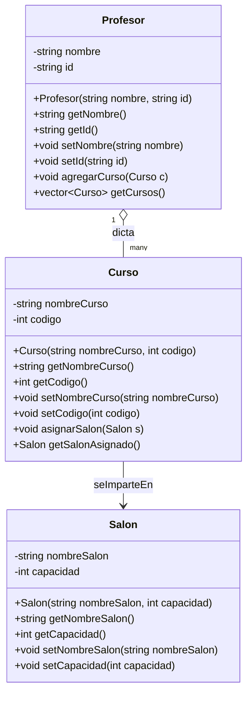

# Mis primeras clases en C++ 
## ¿Qué es un lenguaje compilado?

Un **lenguaje compilado** es aquel en el que el código fuente (los archivos que escribimos con nuestra lógica) se **traduce completamente** a código máquina antes de ser ejecutado.

- **Traducción a código máquina**: Significa que el programa queda en un formato que la computadora entiende directamente (un archivo ejecutable).
- **Ejemplos**: C, C++, Rust, Go.
- En C++, escribimos archivos `.cpp` y `.h`, luego usamos un programa llamado **compilador** (por ejemplo, `g++` en Linux/Mac o MinGW en Windows) que genera un **ejecutable** (por ejemplo, `miPrograma.exe` o `./miPrograma`).

> **Compilador**: Es un programa que lee tu código fuente, lo analiza y lo transforma en un archivo binario listo para ejecutarse.

El hecho de que esté "compilado" significa que una vez creado ese ejecutable, podemos ejecutarlo sin necesidad de un intérprete en el sistema final, siempre y cuando tengamos el sistema operativo adecuado y las librerías requeridas.

---

## Comparación con un lenguaje interpretado

Los **lenguajes interpretados** (como Python, JavaScript o PHP) no producen típicamente un solo ejecutable autónomo, sino que **requieren** de un **intérprete** o **máquina virtual** para poder funcionar.

- **Intérprete**: Programa que lee el código "línea a línea" o "instrucción a instrucción" y lo va ejecutando al momento.
- **Máquina virtual**: Software que simula un entorno de ejecución, muy común en lenguajes como Java.

**Ventajas de los interpretados**:
- Mayor **flexibilidad** y **rapidez de prototipado**.
- Suelen ser más sencillos de depurar en tiempo real porque no requieren recompilar.

**Desventajas**:
- Al ejecutarse línea a línea, pueden ser más **lentos** que un compilado, dependiendo del tipo de tarea.
- El usuario necesita el intérprete (o la máquina virtual) instalado.

---

## Ventajas de un lenguaje compilado

1. **Mayor velocidad de ejecución**: Al no interpretarse en tiempo real, el tiempo de ejecución suele ser menor.
2. **Optimizaciones del compilador**: El compilador puede analizar y optimizar el código en diferentes fases (por ejemplo, reordenar instrucciones para que sean más eficientes).
3. **Distribución sencilla**: Puedes entregar el archivo ejecutable, y el usuario final no necesita tener un intérprete.

> **Ejecutable**: Archivo final que tu sistema operativo puede correr directamente, como `miPrograma.exe` en Windows o `./miPrograma` en Linux.

---

## Por qué puede ser más rápido un lenguaje compilado

1. **Sin capa de interpretación**: Al no traducir instrucción por instrucción en tiempo de ejecución, se **ahorra** ese procesamiento adicional.
2. **Compilador**: Realiza **optimizaciones** a nivel de hardware, como usar mejor los registros de la CPU, "desenrollar bucles" (loop unrolling) o "insertar" llamadas de funciones simples (inlining), todo lo cual acelera la ejecución.

---
## Tipado Fuerte y Diferencias con Python

Cuando decimos que un lenguaje es **fuertemente tipado**, nos referimos a que:

- Cada variable tiene un **tipo** (por ejemplo, `int`, `float`, `string`) y el compilador **exige** coherencia al usarlas.
- No se puede convertir una variable a otro tipo incompatible sin que el compilador reclame o requiera una conversión explícita.

> **Tipo**: Define qué clase de datos se almacenan en la variable (por ejemplo, números enteros, texto, etc.) y qué operaciones se pueden realizar sobre ese valor.

**En C++**:

- Si declaras `int x = 10;`, no podrás asignarle directamente un `double*` o un `std::string` sin que ocurra un **error de compilación**.
- La mayoría de los errores de tipo se detectan antes de ejecutar el programa, haciendo que los errores aparezcan temprano en el proceso.

**En Python**:

- Python también es **fuertemente tipado** (cada objeto en Python tiene un tipo), pero es **dinámicamente tipado** (no necesitas declarar el tipo antes de usarlo).
- Python hace muchas conversiones internamente y asocia los tipos a los **objetos**, no a las **variables**.
- Muchos errores de tipo se detectan en **tiempo de ejecución** (es decir, cuando ya se está corriendo el programa).

**¿Beneficio de C++?**

- El compilador **detecta** errores de tipo y problemas de sintaxis antes de ejecutar el programa, haciéndolo más **robusto** y predecible.

### Diferencias Claves entre Python y C++

| Característica           | Python                         | C++                                        |
| ------------------------ | ------------------------------ | ------------------------------------------ |
| **Tipado**               | Dinámico (no tipado)           | Estático (fuertemente tipado)              |
| **Definición de clases** | class sin tipos                | class con tipos especificados              |
| **Instanciación**        | `obj = Clase()`                | `Clase obj;` o `Clase* obj = new Clase();` |
| **Memoria**              | Automática (Garbage Collector) | Manual (uso de `new` y `delete`)           |s librerías necesarias, para formar el **ejecutable** final. Si faltan definiciones de funciones u otros símbolos, surgirá un **error de enlazado**.

---

#- **Directivas de preprocesador**: Le indican al compilador (o más específicamente, al preprocesador) que realice tareas específicas **antes** de compilar el código principal. Por ejemplo:
  - `#include <iostream>`: Copia el contenido del archivo de cabecera (en este caso, de la librería de entrada y salida estándar) en tu código.
  - `#define MAX 100`: Define una constante o macro llamada `MAX` con el valor 100, que luego será sustituido en el código.

Durante el **preprocesado**, se **expanden** estas directivas. Para el caso de `#include`, se copia todo el contenido del archivo incluido dentro de tu archivo final, antes de pasar a la etapa de compilación.

### Compilación

En la **compilación**, el compilador traduce el código fuente (ya preprocesado) de cada archivo `.cpp` a un archivo objeto (`.o` en Linux/macOS o `.obj` en Windows). En esta etapa se revisa la sintaxis, los tipos de datos, la corrección del código, etc.

### Enlazado (Linking)

En el **enlazado**, los distintos archivos objeto se unen entre sí, junto con las librerías necesarias, para formar el **ejecutable** final. Si faltan definiciones de funciones u otros símbolos, surgirá un **error de enlazado**.

---

**Ejemplo de compilación**: Si tenemos un solo archivo `main.cpp`, podemos compilar y ejecutar en Linux/Mac:

```bash
g++ main.cpp -o miPrograma
./miPrograma
```

En Windows (con g++ de MinGW):

```bash
g++ main.cpp -o miPrograma.exe
miPrograma.exe
```

---

## ¿Qué se necesita para que un programa en C++ funcione?

1. **Compilador**: Necesitas contar con un compilador C++ instalado en tu sistema, por ejemplo `g++` o `clang++`. Este se encarga de traducir el código fuente en un ejecutable.
2. **Bibliotecas estándar**: C++ provee librerías como `<iostream>` (para imprimir en consola), `<vector>`, `<string>`, etc. Estas librerías normalmente vienen con el compilador.
3. **Sistema operativo**: El programa compilado deberá ser compatible con el sistema operativo para el cual fue compilado (Windows, Linux, macOS, etc.).
4. **Ambiente de ejecución**: Para programas de consola, solo necesitas el ejecutable y las bibliotecas asociadas (normalmente incluidas en la instalación de C++). Para interfaces gráficas u otras librerías, debes asegurarte de que estén instaladas.

---

## Partes típicas de un proyecto en C++

En un proyecto de C++ de tamaño mediano o grande, es común tener:

1. **Archivos de encabezado (`.h` o `.hpp`)**: Contienen las **declaraciones** de clases, funciones y constantes. Normalmente incluyen:
   - `#ifndef`, `#define`, `#endif` (las llamadas guardas de inclusión) para evitar que se incluya el archivo varias veces.

Ejemplo de una guarda en un archivo de encabezado:

```cpp
#ifndef MI_CLASE_H
#define MI_CLASE_H

class MiClase {
private:
    int atributo;
public:
    MiClase(int valor);
    int getAtributo();
};

#endif // MI_CLASE_H
```

En este ejemplo:
- `#ifndef MI_CLASE_H` verifica si `MI_CLASE_H` no ha sido definido antes.
- `#define MI_CLASE_H` lo define para que el archivo solo se procese una vez.
- `#endif` marca el final de la inclusión condicional.
   - `#include` de otras librerías o encabezados necesarios.
   - Definiciones de las clases (atributos y métodos) pero sin la implementación completa de las funciones.

2. **Archivos fuente (********`.cpp`********\*\*\*\*)**: Contienen las **implementaciones** de las clases y funciones declaradas en los archivos `.h`:

   - `#include "MiClase.h"` para poder implementar esas clases.
   - El cuerpo de cada método, usando el **operador de resolución de ámbito** (`::`) para indicar que pertenece a la clase declarada en el `.h`.

3. **Archivo principal (********`main.cpp`********\*\*\*\*)**: Es el **punto de entrada** del programa. Allí implementas la función `int main()` que, al ejecutarse, inicia tu aplicación.

4. **Fichero de construcción (CMakeLists.txt, Makefile, etc.)** (opcional pero muy recomendado para proyectos más grandes): Indica al compilador cómo compilar y enlazar los distintos archivos, qué librerías incluir, etc. Por ejemplo, en proyectos con CMake, se define este archivo para especificar rutas, nombres de ejecutable, etc.

5. **Carpetas organizadas** (opcional, pero útil):

   - `include/` para archivos de encabezado.
   - `src/` para archivos fuente.
   - `build/` para colocar los archivos objeto y ejecutables.

---

### ¿Cómo se asocian los atributos y métodos definidos en UML con la parte práctica?

Cuando diseñamos nuestras clases en UML, definimos sus **atributos** (por ejemplo, `nombre`, `id`) y sus **métodos** (por ejemplo, `getNombre()`, `setNombre()`), junto con las relaciones (asociaciones, agregaciones, etc.). En C++:

- **Atributos**: se convierten en **variables miembro** dentro de nuestras clases en los archivos `.h`. Normalmente los colocamos como `private` para mantener el encapsulamiento.
- **Métodos**: se declaran en el archivo `.h` como funciones dentro de la clase, y se **implementan** en el archivo `.cpp` usando el operador de resolución de ámbito (`Clase::metodo`).
- **Relaciones**: si en UML decimos que un `Profesor` puede dictar varios `Curso`, usamos un contenedor, por ejemplo `std::vector<Curso>`, para representar esa relación en C++.
- **main**: la parte práctica se concreta en `main.cpp`, donde instanciamos nuestros objetos y comprobamos su funcionamiento. Recuerda que solo puede existir un `main`.

Gracias a esta separación (declaraciones en `.h`, implementación en `.cpp`, y punto de entrada en `main.cpp`), el proyecto adquiere un orden claro. Si quieres modificar atributos de `Profesor`, cambias su declaración en el header (`.h`), implementas la lógica que necesites en el `.cpp`, y usas esos cambios en tu `main.cpp`.

Ahora que hemos revisado los fundamentos de la compilación, las partes típicas de un proyecto en C++ y cómo estructurar nuestro código fuente, vamos a llevar todo ese conocimiento a la práctica. En esta sección, diseñaremos un programa orientado a objetos mediante UML y luego mostraremos la transición de ese diseño al código en C++.

## CLion: Un IDE para C++

Un **IDE (Integrated Development Environment)** es un programa que integra diversas herramientas de desarrollo en una sola aplicación. Para C++, uno de los entornos más populares y potentes es **CLion**, desarrollado por JetBrains. A continuación, algunas de sus funcionalidades importantes y por qué usar un IDE puede resultar muy beneficioso:

1. **Edición con resaltado de sintaxis**: CLion reconoce la estructura de tu código C++, colorea y formatea automáticamente los elementos (palabras clave, variables, métodos, etc.). Esto facilita la lectura y ayuda a prevenir errores.
2. **Autocompletado inteligente (Code Completion)**: Mientras escribes, CLion sugiere nombres de variables, funciones, clases y métodos existentes en tu proyecto. Esto acelera la velocidad de programación y reduce errores de tipeo.
3. **Depuración (Debugging)**: Con CLion puedes poner puntos de interrupción (breakpoints), inspeccionar variables en tiempo real, ejecutar tu código paso a paso y revisar el flujo para encontrar errores lógicos.
4. **Integración con CMake**: CMake es una herramienta de configuración y compilación multiplataforma. CLion se integra perfectamente con CMake, permitiéndote gestionar proyectos grandes sin complicaciones.
5. **Gestión de proyectos y archivos**: CLion te facilita organizar tus carpetas, archivos fuente, librerías y dependencias en un solo lugar. Esto es útil para mantener una estructura clara en proyectos de tamaño mediano o grande.
6. **Control de versiones**: CLion ofrece integración con sistemas como Git o SVN. Puedes hacer commits, push, pull, ver el historial de cambios, etc., directamente desde el IDE.
7. **Refactorización**: Herramientas que permiten cambiar el nombre de variables, extraer funciones, reestructurar clases, todo de manera automática y segura. El IDE se encarga de aplicar los cambios en todos los lugares donde se use ese código.
8. **Productividad y mantenimiento**: Al unificar la edición de código, la compilación, la depuración y la gestión de versiones, CLion ayuda a que el flujo de trabajo sea más ágil y mantenible.

> **¿Por qué es importante usar un IDE como CLion?**
>
> - **Ahorra tiempo**: automatiza tareas comunes, como la compilación y la generación de archivos.
> - **Ayuda a encontrar errores**: el resaltado de sintaxis y el debugging integrado facilitan la detección de fallos.
> - **Favorece el aprendizaje**: ver los avisos de error inmediatamente, contar con autocompletado y ver ejemplos de uso refuerza la comprensión del lenguaje.
> - **Entorno unificado**: todo en un solo lugar: editor, compilador, debugger, control de versiones, etc.


## Diseño UML y Ejemplo Práctico en C++

### Enunciado: Diseña UML con Profesor, Curso y Salón

Imagina que trabajas en la Oficina de Registro Académico de la **Universidad XYZ**. El objetivo principal es organizar la información sobre la asignación de cursos a los profesores asociados y sobre en qué salones se dicta cada curso. Se sabe lo siguiente:

- **Profesor**: Persona que dicta uno o varios cursos. Además de su nombre e identificación, puede estar asociado a múltiples cursos.
- **Curso**: Toda asignatura que ofrece la universidad. Cada curso tiene un nombre, un código único y se imparte en un único salón.
- **Salón**: Espacio físico en el campus universitario. Se identifica por un nombre o número y tiene una capacidad limitada de estudiantes.

La **gerencia de la universidad** desea que se diseñe un sistema para:

1. **Administrar** los datos de cada profesor (nombre, ID) y los cursos que dicta.
2. **Controlar** la información de cada curso (nombre, código) y el salón asignado.
3. **Monitorear** las características del salón (nombre, capacidad).

En la práctica:

- Un Profesor puede dictar uno **o varios** cursos a lo largo de un período.
- Cada Curso se dicta en un **solo Salón**, el cual determina cuántos estudiantes se pueden matricular.

**Práctica**: A partir de esta historia, diseña un **diagrama UML** (usando la sintaxis de **mermaid**) que represente las clases `Profesor`, `Curso` y `Salon`. Luego, implementa las clases en C++ separando la declaración (`.h`) de la implementación (`.cpp`) y crea un programa (`main.cpp`) que demuestre la creación de objetos y la relación entre ellos. Asegúrate de contar con al menos cuatro objetos en tu programa: por ejemplo, un par de profesores, un par de cursos y los salones correspondientes.

Finalmente, muestra cómo compilar y ejecutar tu programa. Recuerda que el objetivo de este ejercicio es **fortalecer tus habilidades** para identificar clases, métodos y atributos a partir de una historia y representarlos en UML, antes de llevarlos al código.

### Solución paso a paso

#### 1. Diagrama UML en mermaid



En el diagrama:

- Se muestra una **agregación** (`o--`) de `Profesor` a varios `Curso` (1 a muchos). Esto indica que un profesor tiene una relación de propiedad parcial sobre los cursos, pero los cursos pueden existir sin el profesor.
- `Curso` tiene una **asociación** unidireccional (`-->`) con `Salon`, reflejando que un curso “conoce” el salón donde se dicta, pero el salón no necesita conocer al curso.

#### 2. Código fuente en C++

A continuación, explicamos **paso a paso** la transición a código en C++.

1. **Archivos .h** (cabeceras):

   - Empiezan con **guardas de inclusión** (`#ifndef`, `#define` y `#endif`) para evitar que se incluyan duplicadamente.
   - Se declaran las clases, sus atributos y los métodos que tendrán.
   - Se pueden incluir otras cabeceras necesarias, por ejemplo `#include <string>`.

2. **Archivos .cpp** (implementación):

   - Incluyen la cabecera `.h` para acceder a la declaración de la clase.
   - Desarrollan el **cuerpo** de cada método, usando el **operador de resolución de ámbito** (`Clase::metodo`) para indicar a qué clase pertenece. 

<details>
<summary><b>¿Qué es el operador de resolución de ámbito (::) en C++?</b></summary>

El **operador de resolución de ámbito (`::`)** en C++ se utiliza para especificar a qué espacio de nombres o a qué clase pertenece un identificador. Esto es fundamental cuando definimos los métodos de una clase en un archivo `.cpp` después de haberlos declarado en su correspondiente archivo `.h`.

Ejemplo:

```cpp
class Profesor {
public:
    void mostrarNombre();
};
```

En el archivo `.cpp`, definimos el método utilizando `::` para indicar que pertenece a `Profesor`:

```cpp
#include "Profesor.h"
#include <iostream>

void Profesor::mostrarNombre() {
    std::cout << "Nombre del profesor" << std::endl;
}
```

En este caso, `Profesor::mostrarNombre()` indica que el método `mostrarNombre` pertenece a la clase `Profesor`. Si no usáramos `::`, el compilador no sabría a qué clase pertenece la función.

</details>
   - Pueden incluir librerías adicionales si se necesitan.

3. **Archivo main.cpp**:

   - Incluye las cabeceras principales (por ejemplo `#include "Profesor.h"`, `#include "Curso.h"`, `#include "Salon.h"`).
   - Define la función `int main()`, que es el punto de entrada de la aplicación.
   - Allí, creas objetos, llamas métodos, etc.

A continuación, se muestra un ejemplo concreto:

##### 2.1 Profesor.h

```cpp
#ifndef PROFESOR_H
#define PROFESOR_H

// Librerías necesarias
#include <string>
#include <vector>
#include "Curso.h"  // Para que Profesor sepa sobre la clase Curso

// Declaración de la clase Profesor
class Profesor {
private:
    // Atributos
    std::string nombre;
    std::string id;
    std::vector<Curso> cursos; // Contenedor de cursos

public:
    // Constructor
    Profesor(std::string nombre, std::string id);

    // Métodos de acceso (getters)
    std::string getNombre();
    std::string getId();

    // Métodos para modificar (setters)
    void setNombre(std::string nombre);
    void setId(std::string id);

    // Otros métodos
    void agregarCurso(Curso curso);
    std::vector<Curso> getCursos();
};

#endif
```

1. Usamos `#ifndef PROFESOR_H` y `#define PROFESOR_H` para que este archivo sólo se cargue una vez.
2. Incluimos `<string>` y `<vector>` porque los usamos en los atributos y métodos. También `Curso.h` para poder declarar un vector de tipo `Curso`.
3. Declaramos la clase `Profesor` con sus atributos privados y métodos públicos.

##### 2.2 Profesor.cpp

```cpp
#include "Profesor.h"  // Incluimos la cabecera correspondiente

// Definición del constructor
Profesor::Profesor(std::string nombre, std::string id)
    : nombre(nombre), id(id) {
}

// Definición de métodos
std::string Profesor::getNombre() {
    return nombre;
}

std::string Profesor::getId() {
    return id;
}

void Profesor::setNombre(std::string nombre) {
    this->nombre = nombre;
}

void Profesor::setId(std::string id) {
    this->id = id;
}

void Profesor::agregarCurso(Curso curso) {
    cursos.push_back(curso);
}

std::vector<Curso> Profesor::getCursos() {
    return cursos;
}
```

1. Incluimos `"Profesor.h"` para que el compilador conozca la declaración de la clase.
2. Usamos `Profesor::Profesor(...)` para definir el **constructor**.
3. En el **inicializador** (`: nombre(nombre), id(id)`) asignamos los valores recibidos a los atributos.
4. El resto de métodos se implementan usando la forma `TipoRetorno Clase::metodo() {...}`.

##### 2.3 Curso.h

```cpp
#ifndef CURSO_H
#define CURSO_H

#include <string>
#include "Salon.h" // Para relacionar Curso con Salon

class Curso {
private:
    std::string nombreCurso;
    int codigo;
    Salon salonAsignado;

public:
    Curso(std::string nombreCurso, int codigo);

    std::string getNombreCurso();
    int getCodigo();

    void setNombreCurso(std::string nombreCurso);
    void setCodigo(int codigo);

    void asignarSalon(Salon salon);
    Salon getSalonAsignado();
};

#endif
```

##### 2.4 Curso.cpp

```cpp
#include "Curso.h"

Curso::Curso(std::string nombreCurso, int codigo)
    : nombreCurso(nombreCurso), codigo(codigo) {
}

std::string Curso::getNombreCurso() {
    return nombreCurso;
}

int Curso::getCodigo() {
    return codigo;
}

void Curso::setNombreCurso(std::string nombreCurso) {
    this->nombreCurso = nombreCurso;
}

void Curso::setCodigo(int codigo) {
    this->codigo = codigo;
}

void Curso::asignarSalon(Salon salon) {
    salonAsignado = salon;
}

Salon Curso::getSalonAsignado() {
    return salonAsignado;
}
```

Aquí se implementan todos los métodos del curso y se guarda el `Salon` asignado.

##### 2.5 Salon.h

```cpp
#ifndef SALON_H
#define SALON_H

#include <string>

class Salon {
private:
    std::string nombreSalon;
    int capacidad;

public:
    Salon(std::string nombreSalon, int capacidad);

    std::string getNombreSalon();
    int getCapacidad();

    void setNombreSalon(std::string nombreSalon);
    void setCapacidad(int capacidad);
};

#endif
```

##### 2.6 Salon.cpp

```cpp
#include "Salon.h"

Salon::Salon(std::string nombreSalon, int capacidad)
    : nombreSalon(nombreSalon), capacidad(capacidad) {
}

std::string Salon::getNombreSalon() {
    return nombreSalon;
}

int Salon::getCapacidad() {
    return capacidad;
}

void Salon::setNombreSalon(std::string nombreSalon) {
    this->nombreSalon = nombreSalon;
}

void Salon::setCapacidad(int capacidad) {
    this->capacidad = capacidad;
}
```

##### 2.7 main.cpp

```cpp
#include <iostream>
#include "Profesor.h"
#include "Curso.h"
#include "Salon.h"

int main() {
    // 1. Creamos un objeto Salon
    Salon salon101("Salon 101", 30);

    // 2. Creamos un Curso y lo asignamos al salon anterior
    Curso poo("Programación Orientada a Objetos", 1001);
    poo.asignarSalon(salon101);

    // 3. Creamos un Profesor y le agregamos el curso
    Profesor profJuan("Juan Perez", "P001");
    profJuan.agregarCurso(poo);

    // 4. Creamos otro Salón, otro Curso y otro Profesor
    Salon salon202("Salon 202", 50);
    Curso algebra("Algebra Lineal", 2002);
    algebra.asignarSalon(salon202);

    Profesor profMaria("Maria Lopez", "P002");
    profMaria.agregarCurso(algebra);

    // Mostramos información por consola
    std::cout << "Profesor: " << profJuan.getNombre()
              << " dicta el curso: "
              << profJuan.getCursos()[0].getNombreCurso()
              << " en el salon: "
              << profJuan.getCursos()[0].getSalonAsignado().getNombreSalon()
              << std::endl;

    std::cout << "Otro profesor: " << profMaria.getNombre()
              << " dicta el curso: "
              << profMaria.getCursos()[0].getNombreCurso()
              << " en el salon: "
              << profMaria.getCursos()[0].getSalonAsignado().getNombreSalon()
              << std::endl;

    return 0;
}
```

1. Incluimos `<iostream>` para poder usar `std::cout`.
2. Incluimos los encabezados (`Profesor.h`, `Curso.h`, `Salon.h`) para poder crear objetos de esas clases.
3. Creamos varios objetos y los relacionamos tal como definimos en el diagrama UML.
4. Finalmente, usamos `std::cout` para imprimir datos de interés y comprobar que la relación entre objetos funciona correctamente.

##### 2.8 Compilación

Para compilar un proyecto en C++ de manera eficiente, especialmente en proyectos con múltiples archivos, es recomendable utilizar un sistema de construcción como **CMake**. En un archivo `CMakeLists.txt`, se especifican los archivos fuente, el compilador a usar y las opciones de compilación.

Ejemplo de un `CMakeLists.txt` básico para este proyecto:

```cmake
cmake_minimum_required(VERSION 3.10)
project(MiProyecto)

set(CMAKE_CXX_STANDARD 20)

add_executable(miPrograma 
    Profesor.cpp 
    Curso.cpp 
    Salon.cpp 
    main.cpp)
```

Este archivo define:
- El nombre del proyecto (`MiProyecto`).
- La versión mínima de CMake requerida.
- El estándar de C++ a utilizar (`C++20`).
- Los archivos fuente que deben compilarse en un ejecutable (`miPrograma`).

<details>
<summary><b>Compilar sin CMake (solo con g++)</b></summary>

Si todos estos archivos (`Profesor.h`, `Profesor.cpp`, `Curso.h`, `Curso.cpp`, `Salon.h`, `Salon.cpp`, y `main.cpp`) están en la misma carpeta, se pueden compilar manualmente con:

```bash
g++ Profesor.cpp Curso.cpp Salon.cpp main.cpp -o miPrograma
./miPrograma
```

En Windows (con g++ de MinGW):

```bash
g++ Profesor.cpp Curso.cpp Salon.cpp main.cpp -o miPrograma.exe
miPrograma.exe
```
</details>


## Conclusiones

- **Lenguajes compilados**: generan un ejecutable que puede ejecutarse directamente, ofreciendo ventajas de **rendimiento** y **optimización**.
- **Lenguajes interpretados**: más flexibles y rápidos de desarrollar, pero suelen ser más **lentos** en tiempo de ejecución para ciertas tareas.
- **Tipado fuerte**: C++ exige un control estricto de tipos, lo cual reduce errores en tiempo de ejecución y mejora la robustez. Python, aunque fuertemente tipado, maneja los tipos de forma más flexible y dinámica.
- **UML**: Permite visualizar cómo interactúan las clases antes de escribir el código, promoviendo un mejor diseño de software.
- **Separación `.h` y `.cpp`**: Favorece la modularidad, el mantenimiento y la compilación incremental. Esto es clave en proyectos grandes.
- **main**: Punto de partida de la aplicación donde se instancian objetos y se define la lógica principal.

¡Sigue practicando! Modifica atributos y métodos, agrega más profesores, más cursos y experimenta con las relaciones. De esta forma reforzarás el proceso **diseño (UML) → implementación (C++)**.

