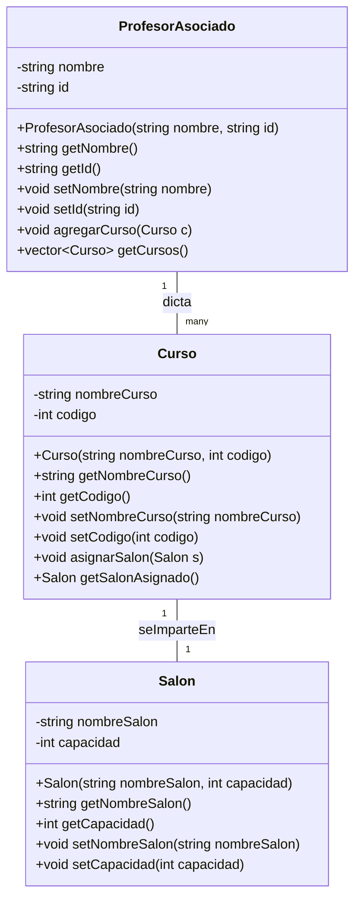

# Mis primeras clases en C++ 
## ¿Qué es un lenguaje compilado?

Un **lenguaje compilado** es aquel en el que el código fuente (los archivos que escribimos con nuestra lógica) se **traduce completamente** a código máquina antes de ser ejecutado.

- **Traducción a código máquina**: Significa que el programa queda en un formato que la computadora entiende directamente (un archivo ejecutable).
- **Ejemplos**: C, C++, Rust, Go.
- En C++, escribimos archivos `.cpp` y `.h`, luego usamos un programa llamado **compilador** (por ejemplo, `g++` en Linux/Mac o MinGW en Windows) que genera un **ejecutable** (por ejemplo, `miPrograma.exe` o `./miPrograma`).

> **Compilador**: Es un programa que lee tu código fuente, lo analiza y lo transforma en un archivo binario listo para ejecutarse.

El hecho de que esté "compilado" significa que una vez creado ese ejecutable, podemos ejecutarlo sin necesidad de un intérprete en el sistema final, siempre y cuando tengamos el sistema operativo adecuado y las librerías requeridas.

---

## Comparación con un lenguaje interpretado

Los **lenguajes interpretados** (como Python, JavaScript o PHP) no producen típicamente un solo ejecutable autónomo, sino que **requieren** de un **intérprete** o **máquina virtual** para poder funcionar.

- **Intérprete**: Programa que lee el código "línea a línea" o "instrucción a instrucción" y lo va ejecutando al momento.
- **Máquina virtual**: Software que simula un entorno de ejecución, muy común en lenguajes como Java.

**Ventajas de los interpretados**:
- Mayor **flexibilidad** y **rapidez de prototipado**.
- Suelen ser más sencillos de depurar en tiempo real porque no requieren recompilar.

**Desventajas**:
- Al ejecutarse línea a línea, pueden ser más **lentos** que un compilado, dependiendo del tipo de tarea.
- El usuario necesita el intérprete (o la máquina virtual) instalado.

---

## Ventajas de un lenguaje compilado

1. **Mayor velocidad de ejecución**: Al no interpretarse en tiempo real, el tiempo de ejecución suele ser menor.
2. **Optimizaciones del compilador**: El compilador puede analizar y optimizar el código en diferentes fases (por ejemplo, reordenar instrucciones para que sean más eficientes).
3. **Distribución sencilla**: Puedes entregar el archivo ejecutable, y el usuario final no necesita tener un intérprete.

> **Ejecutable**: Archivo final que tu sistema operativo puede correr directamente, como `miPrograma.exe` en Windows o `./miPrograma` en Linux.

---

## Por qué puede ser más rápido un lenguaje compilado

1. **Sin capa de interpretación**: Al no traducir instrucción por instrucción en tiempo de ejecución, se **ahorra** ese procesamiento adicional.
2. **Compilador**: Realiza **optimizaciones** a nivel de hardware, como usar mejor los registros de la CPU, "desenrollar bucles" (loop unrolling) o "insertar" llamadas de funciones simples (inlining), todo lo cual acelera la ejecución.

---
## Tipado Fuerte y Diferencias con Python

Cuando decimos que un lenguaje es **fuertemente tipado**, nos referimos a que:

- Cada variable tiene un **tipo** (por ejemplo, `int`, `float`, `string`) y el compilador **exige** coherencia al usarlas.
- No se puede convertir una variable a otro tipo incompatible sin que el compilador reclame o requiera una conversión explícita.

> **Tipo**: Define qué clase de datos se almacenan en la variable (por ejemplo, números enteros, texto, etc.) y qué operaciones se pueden realizar sobre ese valor.

**En C++**:

- Si declaras `int x = 10;`, no podrás asignarle directamente un `double*` o un `std::string` sin que ocurra un **error de compilación**.
- La mayoría de los errores de tipo se detectan antes de ejecutar el programa, haciendo que los errores aparezcan temprano en el proceso.

**En Python**:

- Python también es **fuertemente tipado** (cada objeto en Python tiene un tipo), pero es **dinámicamente tipado** (no necesitas declarar el tipo antes de usarlo).
- Python hace muchas conversiones internamente y asocia los tipos a los **objetos**, no a las **variables**.
- Muchos errores de tipo se detectan en **tiempo de ejecución** (es decir, cuando ya se está corriendo el programa).

**¿Beneficio de C++?**

- El compilador **detecta** errores de tipo y problemas de sintaxis antes de ejecutar el programa, haciéndolo más **robusto** y predecible.

### Diferencias Claves entre Python y C++

| Característica           | Python                         | C++                                        |
| ------------------------ | ------------------------------ | ------------------------------------------ |
| **Tipado**               | Dinámico (no tipado)           | Estático (fuertemente tipado)              |
| **Definición de clases** | class sin tipos                | class con tipos especificados              |
| **Instanciación**        | `obj = Clase()`                | `Clase obj;` o `Clase* obj = new Clase();` |
| **Memoria**              | Automática (Garbage Collector) | Manual (uso de `new` y `delete`)           |s librerías necesarias, para formar el **ejecutable** final. Si faltan definiciones de funciones u otros símbolos, surgirá un **error de enlazado**.

---

#- **Directivas de preprocesador**: Le indican al compilador (o más específicamente, al preprocesador) que realice tareas específicas **antes** de compilar el código principal. Por ejemplo:
  - `#include <iostream>`: Copia el contenido del archivo de cabecera (en este caso, de la librería de entrada y salida estándar) en tu código.
  - `#define MAX 100`: Define una constante o macro llamada `MAX` con el valor 100, que luego será sustituido en el código.

Durante el **preprocesado**, se **expanden** estas directivas. Para el caso de `#include`, se copia todo el contenido del archivo incluido dentro de tu archivo final, antes de pasar a la etapa de compilación.

### Compilación

En la **compilación**, el compilador traduce el código fuente (ya preprocesado) de cada archivo `.cpp` a un archivo objeto (`.o` en Linux/macOS o `.obj` en Windows). En esta etapa se revisa la sintaxis, los tipos de datos, la corrección del código, etc.

### Enlazado (Linking)

En el **enlazado**, los distintos archivos objeto se unen entre sí, junto con las librerías necesarias, para formar el **ejecutable** final. Si faltan definiciones de funciones u otros símbolos, surgirá un **error de enlazado**.

---

**Ejemplo de compilación**: Si tenemos un solo archivo `main.cpp`, podemos compilar y ejecutar en Linux/Mac:

```bash
g++ main.cpp -o miPrograma
./miPrograma
```

En Windows (con g++ de MinGW):

```bash
g++ main.cpp -o miPrograma.exe
miPrograma.exe
```

---

## ¿Qué se necesita para que un programa en C++ funcione?

1. **Compilador**: Necesitas contar con un compilador C++ instalado en tu sistema, por ejemplo `g++` o `clang++`. Este se encarga de traducir el código fuente en un ejecutable.
2. **Bibliotecas estándar**: C++ provee librerías como `<iostream>` (para imprimir en consola), `<vector>`, `<string>`, etc. Estas librerías normalmente vienen con el compilador.
3. **Sistema operativo**: El programa compilado deberá ser compatible con el sistema operativo para el cual fue compilado (Windows, Linux, macOS, etc.).
4. **Ambiente de ejecución**: Para programas de consola, solo necesitas el ejecutable y las bibliotecas asociadas (normalmente incluidas en la instalación de C++). Para interfaces gráficas u otras librerías, debes asegurarte de que estén instaladas.

---

## Partes típicas de un proyecto en C++

En un proyecto de C++ de tamaño mediano o grande, es común tener:

1. **Archivos de encabezado (********`.h`********\*\*\*\* o ************`.hpp`************)**: Contienen las **declaraciones** de clases, funciones y constantes. Normalmente incluyen:

   - `#ifndef`, `#define`, `#endif` (las llamadas guardas de inclusión) para evitar que se incluya el archivo varias veces.
   - `#include` de otras librerías o encabezados necesarios.
   - Definiciones de las clases (atributos y métodos) pero sin la implementación completa de las funciones.

2. **Archivos fuente (********`.cpp`********\*\*\*\*)**: Contienen las **implementaciones** de las clases y funciones declaradas en los archivos `.h`:

   - `#include "MiClase.h"` para poder implementar esas clases.
   - El cuerpo de cada método, usando el **operador de resolución de ámbito** (`::`) para indicar que pertenece a la clase declarada en el `.h`.

3. **Archivo principal (********`main.cpp`********\*\*\*\*)**: Es el **punto de entrada** del programa. Allí implementas la función `int main()` que, al ejecutarse, inicia tu aplicación.

4. **Fichero de construcción (CMakeLists.txt, Makefile, etc.)** (opcional pero muy recomendado para proyectos más grandes): Indica al compilador cómo compilar y enlazar los distintos archivos, qué librerías incluir, etc. Por ejemplo, en proyectos con CMake, se define este archivo para especificar rutas, nombres de ejecutable, etc.

5. **Carpetas organizadas** (opcional, pero útil):

   - `include/` para archivos de encabezado.
   - `src/` para archivos fuente.
   - `build/` para colocar los archivos objeto y ejecutables.

---

## Enunciado: Diseña UML con Profesor, Curso y Salón

**Enunciado:**

1. Representa en un **diagrama UML** (usando la sintaxis de **mermaid**) las siguientes clases:
   - `ProfesorAsociado`
   - `Curso`
   - `Salon`
2. Cada clase debe contener al menos 2 o 3 atributos relevantes y métodos para **establecer** y **obtener** dichos atributos.
3. Un **ProfesorAsociado** puede dictar **uno o varios** Cursos.
4. Un **Curso** se imparte en un **Salón** específico.
5. Implementa las clases en C++ separando **declaración** (`.h`) de **implementación** (`.cpp`).
6. Crea un archivo `main.cpp` con el **método `main`** (punto de entrada del programa) donde:
   - Se creen **al menos 4 objetos** (por ejemplo, un objeto para Salón, uno para Curso, uno para Profesor, etc.).
   - Demuestra la relación creando **otro profesor** con su propio **curso** y **salón**.

---

## Solución paso a paso

<details>
  <summary>Mostrar/Ocultar Solución</summary>

### 1. Diagrama UML en mermaid



### 2. Código fuente en C++

A continuación, se muestra la **separación** de declaraciones en `.h` y definiciones en `.cpp`. Esta técnica se usa para mantener el código organizado y facilitar la lectura y mantenimiento.

#### 2.1 ProfesorAsociado.h

```cpp
#ifndef PROFESORASOCIADO_H
#define PROFESORASOCIADO_H

#include <string>
#include <vector>
#include "Curso.h"

class ProfesorAsociado {
private:
    std::string nombre;
    std::string id;
    std::vector<Curso> cursos;

public:
    ProfesorAsociado(std::string nombre, std::string id);

    std::string getNombre();
    std::string getId();
    void setNombre(std::string nombre);
    void setId(std::string id);

    void agregarCurso(Curso curso);
    std::vector<Curso> getCursos();
};

#endif
```

#### 2.2 ProfesorAsociado.cpp

```cpp
#include "ProfesorAsociado.h"

ProfesorAsociado::ProfesorAsociado(std::string nombre, std::string id)
    : nombre(nombre), id(id) {
}

std::string ProfesorAsociado::getNombre() {
    return nombre;
}

std::string ProfesorAsociado::getId() {
    return id;
}

void ProfesorAsociado::setNombre(std::string nombre) {
    this->nombre = nombre;
}

void ProfesorAsociado::setId(std::string id) {
    this->id = id;
}

void ProfesorAsociado::agregarCurso(Curso curso) {
    cursos.push_back(curso);
}

std::vector<Curso> ProfesorAsociado::getCursos() {
    return cursos;
}
```

#### 2.3 Curso.h

```cpp
#ifndef CURSO_H
#define CURSO_H

#include <string>
#include "Salon.h"

class Curso {
private:
    std::string nombreCurso;
    int codigo;
    Salon salonAsignado;

public:
    Curso(std::string nombreCurso, int codigo);

    std::string getNombreCurso();
    int getCodigo();

    void setNombreCurso(std::string nombreCurso);
    void setCodigo(int codigo);

    void asignarSalon(Salon salon);
    Salon getSalonAsignado();
};

#endif
```

#### 2.4 Curso.cpp

```cpp
#include "Curso.h"

Curso::Curso(std::string nombreCurso, int codigo)
    : nombreCurso(nombreCurso), codigo(codigo) {
}

std::string Curso::getNombreCurso() {
    return nombreCurso;
}

int Curso::getCodigo() {
    return codigo;
}

void Curso::setNombreCurso(std::string nombreCurso) {
    this->nombreCurso = nombreCurso;
}

void Curso::setCodigo(int codigo) {
    this->codigo = codigo;
}

void Curso::asignarSalon(Salon salon) {
    salonAsignado = salon;
}

Salon Curso::getSalonAsignado() {
    return salonAsignado;
}
```

#### 2.5 Salon.h

```cpp
#ifndef SALON_H
#define SALON_H

#include <string>

class Salon {
private:
    std::string nombreSalon;
    int capacidad;

public:
    Salon(std::string nombreSalon, int capacidad);

    std::string getNombreSalon();
    int getCapacidad();

    void setNombreSalon(std::string nombreSalon);
    void setCapacidad(int capacidad);
};

#endif
```

#### 2.6 Salon.cpp

```cpp
#include "Salon.h"

Salon::Salon(std::string nombreSalon, int capacidad)
    : nombreSalon(nombreSalon), capacidad(capacidad) {
}

std::string Salon::getNombreSalon() {
    return nombreSalon;
}

int Salon::getCapacidad() {
    return capacidad;
}

void Salon::setNombreSalon(std::string nombreSalon) {
    this->nombreSalon = nombreSalon;
}

void Salon::setCapacidad(int capacidad) {
    this->capacidad = capacidad;
}
```

### 3. Ejemplo de `main.cpp`

El **método `main`** en C++ es el **punto de entrada** de tu programa. Allí iniciará la ejecución.

```cpp
#include <iostream>
#include "ProfesorAsociado.h"
#include "Curso.h"
#include "Salon.h"

int main() {
    // Creación de objetos (al menos 4 como se solicita)
    // 1. Salon
    Salon salon101("Salon 101", 30);

    // 2. Curso
    Curso poo("Programación Orientada a Objetos", 1001);
    poo.asignarSalon(salon101);

    // 3. ProfesorAsociado
    ProfesorAsociado profJuan("Juan Perez", "P001");
    profJuan.agregarCurso(poo);

    // 4. Otra combinación de objetos
    Salon salon202("Salon 202", 50);
    Curso algebra("Algebra Lineal", 2002);
    algebra.asignarSalon(salon202);

    ProfesorAsociado profMaria("Maria Lopez", "P002");
    profMaria.agregarCurso(algebra);

    // Mostramos información por consola
    std::cout << "Profesor: " << profJuan.getNombre()
              << " dicta el curso: "
              << profJuan.getCursos()[0].getNombreCurso()
              << " en el salon: "
              << profJuan.getCursos()[0].getSalonAsignado().getNombreSalon()
              << std::endl;

    std::cout << "Otro profesor: " << profMaria.getNombre()
              << " dicta el curso: "
              << profMaria.getCursos()[0].getNombreCurso()
              << " en el salon: "
              << profMaria.getCursos()[0].getSalonAsignado().getNombreSalon()
              << std::endl;

    return 0;
}
```

### 4. Cómo compilar

Si todos estos archivos (`ProfesorAsociado.h`, `ProfesorAsociado.cpp`, `Curso.h`, `Curso.cpp`, `Salon.h`, `Salon.cpp`, y `main.cpp`) están en la misma carpeta:

```bash
g++ ProfesorAsociado.cpp Curso.cpp Salon.cpp main.cpp -o miPrograma
./miPrograma
```

En Windows:
```bash
g++ ProfesorAsociado.cpp Curso.cpp Salon.cpp main.cpp -o miPrograma.exe
miPrograma.exe
```

</details>

---

## Conclusiones

- **Lenguajes compilados**: generan un ejecutable que puede ejecutarse directamente, ofreciendo ventajas de **rendimiento** y **optimización**.
- **Lenguajes interpretados**: más flexibles y rápidos de desarrollar, pero suelen ser más **lentos** en tiempo de ejecución para ciertas tareas.
- **Tipado fuerte**: C++ exige un control estricto de tipos, lo cual reduce errores en tiempo de ejecución y mejora la robustez. Python, aunque fuertemente tipado, maneja los tipos de forma más flexible y dinámica.
- **UML**: Permite visualizar cómo interactúan las clases antes de escribir el código, promoviendo un mejor diseño de software.
- **Separación `.h` y `.cpp`**: Favorece la modularidad, el mantenimiento y la compilación incremental. Esto es clave en proyectos grandes.
- **main**: Punto de partida de la aplicación donde se instancian objetos y se define la lógica principal.

¡Sigue practicando! Modifica atributos y métodos, agrega más profesores, más cursos y experimenta con las relaciones. De esta forma reforzarás el proceso **diseño (UML) → implementación (C++)**.

