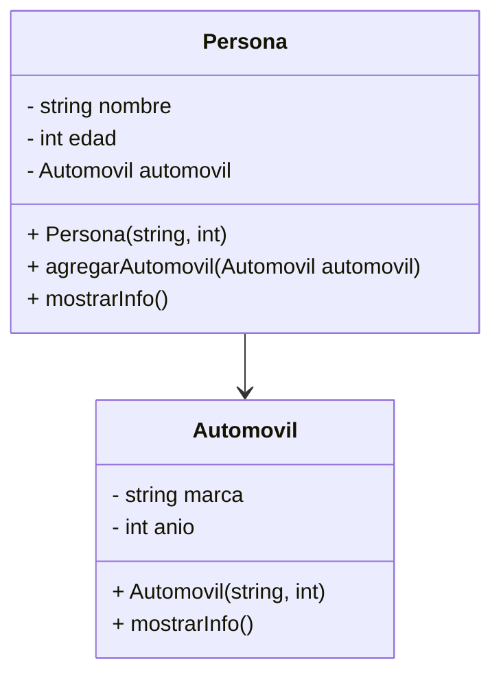
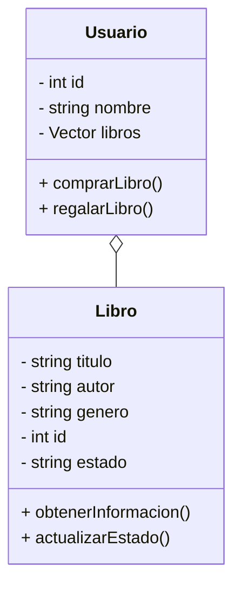
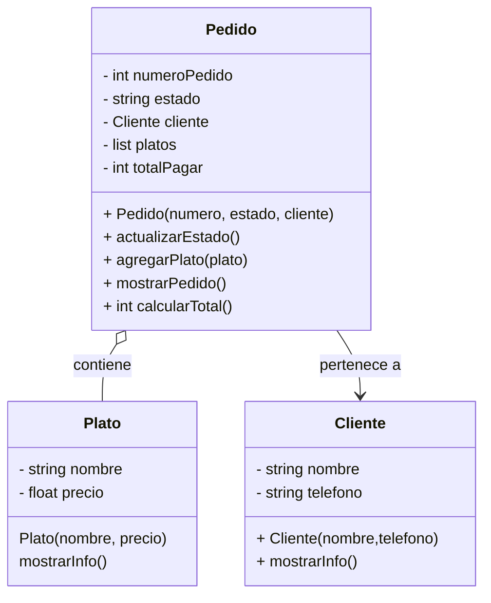

##  Ejercicios

Siguiendo el ejemplo disponible en: https://github.com/lufe089/POOEjemploCurso: 

* Haga la codificación de las clases que corresponden a los siguientes diagramas. Puede agregar métodos y funcionalidades si lo desea y hacer ajustes en los 
parametros de los métodos.  **Recuerde crear un proyecto nuevo para cada caso**
* Cree objetos en el main de todos los tipos para probar que su código funciona
* Relacione los objetos entre si, por ejemplo agregue un automóvil a una persona.  

Puede consultar sus dudas sobre cómo hacer la codificación aquí: https://github.com/lufe089/POO/blob/main/3.CodificacionCpp.md

### Ejercicio 1 Persona y automóvil

#### **Requisitos**
1. Implementa las clases `Persona` y `Automovil` siguiendo la estructura del diagrama de clases proporcionado.
2. Implementa los métodos constructores según lo especificado.
3. Implementa el método `agregarAutomovil(Automovil automovil)` en la clase `Persona`, el cual debe permitir asociar un automóvil a la persona.
4. Implementa el método `mostrarInfo()` en ambas clases, que debe imprimir los atributos de la instancia en la consola.
5. En el `main()`, realiza las siguientes acciones:
   - Crea al menos dos objetos de la clase `Persona` con diferentes nombres y edades.
   - Crea al menos dos objetos de la clase `Automovil` con diferentes marcas y años.
   - Asigna un automóvil a cada persona utilizando el método `agregarAutomovil`.
   - Llama al método `mostrarInfo()` de cada persona para visualizar sus datos y los de su automóvil.

#### **Ejemplo de Salida Esperada**
>Nombre: Juan Pérez Edad: 30 años Automóvil: Toyota, Año: 2020

>Nombre: María Gómez Edad: 25 años Automóvil: Ford, Año: 2018

### Ejercicio 2 Lector

#### **Requisitos**
1. Implementa las clases `Libro` y `Usuario` siguiendo la estructura del diagrama de clases proporcionado.
2. Implementa los métodos constructores según lo especificado.
3. En la clase `Libro`, implementa:
   - Un método `obtenerInformacion()`, que imprima los atributos del libro en la consola.
   - Un método `actualizarEstado(string nuevoEstado)`, que actualice el estado del libro.
4. En la clase `Usuario`, implementa:
   - Un método `comprarLibro(Libro libro)`, que agregue un libro a la colección del usuario.
   - Un método `regalarLibro(int idLibro)`, que busque el libro de la colección y lo elimine
5. En el `main()`, realiza las siguientes acciones:
   - Crea al menos dos objetos de la clase `Usuario` con diferentes nombres e identificadores.
   - Crea al menos tres objetos de la clase `Libro` con diferentes títulos, autores y géneros.
   - Cada usuario debe comprar al menos dos libros.
   - Un usuario debe regalar un libro
   - Llama al método `obtenerInformacion()` de cada libro y muestra la lista de libros de regalarlos

#### **Ejemplo de Salida Esperada**
>Usuario: Carlos López ID: 101 Libros:
"1984" de George Orwell (Género: Distopía) - Estado: Nuevo
"El Principito" de Antoine de Saint-Exupéry (Género: Infantil) - Estado: Usado
Usuario: Ana Pérez ID: 102 Libros:
"Cien años de soledad" de Gabriel García Márquez (Género: Realismo mágico) - Estado: Nuevo

### Pedidos

#### Instrucciones
1. Implementa las clases `Cliente`, `Pedido` y `Plato` siguiendo la estructura del diagrama de clases proporcionado.
2. En la clase `Plato`, implementa:
   - Un constructor que reciba el nombre del plato y su precio.
   - Un método `mostrarInfo()`, que imprima el nombre y precio del plato.
3. En la clase `Cliente`, implementa:
   - Un constructor que reciba el nombre y teléfono del cliente.
   - Un método `mostrarInfo()`, que imprima los datos del cliente.
4. En la clase `Pedido`, implementa:
   - Un constructor que reciba el número de pedido, el estado y el cliente asociado.
   - Un método `agregarPlato(Plato plato)`, que agregue platos al pedido.
   - Un método `mostrarPedido()`, que muestre el número de pedido, el estado, los datos del cliente y la lista de platos con sus precios.
   - Un método `totalPagar()` que retorne el valor total del pedido.
5. En el `main()`, realiza las siguientes acciones:
   - Crea al menos dos clientes con diferentes nombres y teléfonos.
   - Crea al menos tres platos con diferentes nombres y precios.
   - Crea al menos dos pedidos, asignando un cliente a cada uno y agregando platos a los pedidos.
   - Llama al método `mostrarPedido()` para visualizar la información de cada pedido.

## **Ejemplo de Salida Esperada**
> Pedido #1001 - Estado: En preparación Cliente: Juan Pérez - Teléfono: 123456789 Platos:

> Pizza Margarita - $25.50
> Ensalada César - $15.00 Total: $40.50

> Pedido #1002 - Estado: Entregado Cliente: Ana Gómez - Teléfono: 987654321 Platos:
>Pasta Alfredo - $22.00
>Tiramisú - $10.00 Total: $32.00
