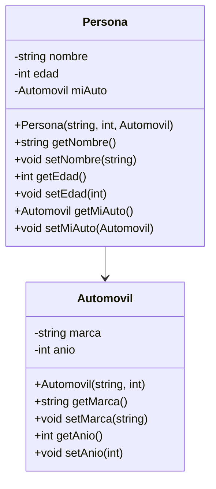
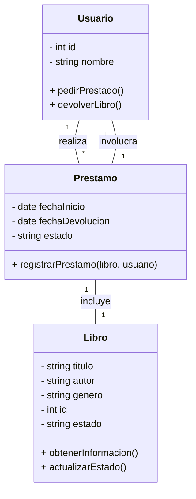
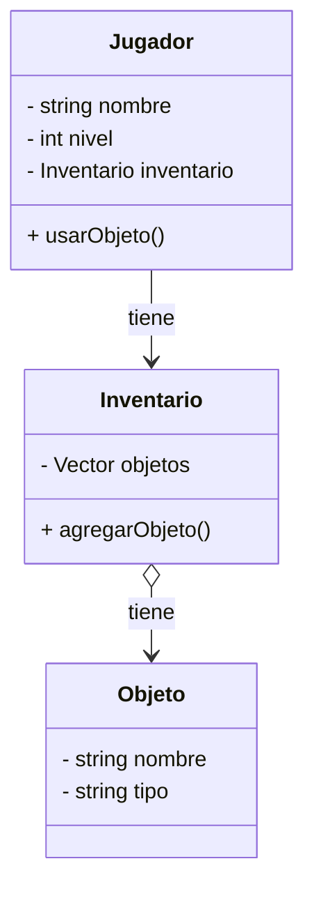

##  Ejercicios

Siguiendo el ejemplo disponible en: https://github.com/lufe089/POOEjemploCurso: 

* Haga la codificación de las clases que corresponden a los siguientes diagramas. Puede agregar métodos y funcionalidades si lo desea y hacer ajustes en los 
parametros de los métodos.  **Recuerde crear un proyecto nuevo para cada caso**
* Cree objetos en el main de todos los tipos para probar que su código funciona
* Relacione los objetos entre si, por ejemplo agregue un automóvil a una persona.  

Puede consultar sus dudas sobre cómo hacer la codificación aquí: https://github.com/lufe089/POO/blob/main/3.CodificacionCpp.md

### Persona y automóvil

### Biblioteca

### Pedidos

### Jugadores e inventario

