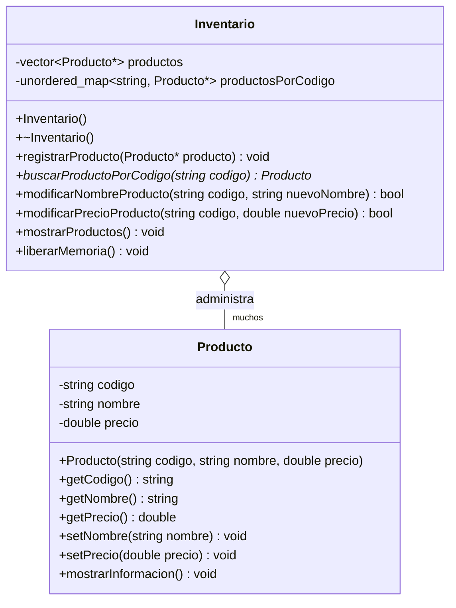

# Productos, inventario, referencias, apuntadores, memoria dinámica y STL en C++

Este material está pensado para leerse con lápiz en mano: conviene detenerse en los ejemplos, seguir el recorrido de los apuntadores, anticipar qué cambia y qué no cambia, y volver al diagrama de clases cada vez que aparezca una duda. La comprensión mejora mucho cuando se estudia el código como una historia paso a paso y no solo como una lista de reglas.

## 0. Cómo leer y aprovechar este material

Antes de empezar, conviene tener presentes algunas decisiones de estilo que se mantendrán en todos los ejemplos. La idea es que el código se vea uniforme y que puedas concentrarte en los conceptos sin distraerte con cambios innecesarios de forma.

- Se evita `using namespace std;`.
- Se usan declaraciones puntuales como `using std::cout;`.
- Se usa `camelCase` para variables, funciones, métodos y atributos.
- Las clases empiezan con mayúscula.
- El código se organiza en archivos `.h` y `.cpp`.
- Los nombres de clases, métodos y variables están en español.

Ejemplo:

```cpp
#include <iostream>
#include <string>
#include <vector>
#include <unordered_map>

using std::cin;
using std::cout;
using std::endl;
using std::string;
using std::unordered_map;
using std::vector;
```

Estas decisiones hacen que el código sea más claro, más consistente y más fácil de revisar cuando vuelvas sobre él para estudiar.

---

## Cómo trabajar este material en clase

Este material está pensado para que avances de manera guiada, pero con trabajo activo de tu parte. La idea no es solo leerlo de principio a fin. La idea es que vayas construyendo, probando, corrigiendo y dejando evidencia de tu proceso mientras desarrollas el sistema.

La ruta de trabajo sugerida es esta:

1. **Lee una sección corta** y asegúrate de entender la idea principal antes de seguir.
2. **Observa el código con calma** y relaciónalo con el diagrama de clases.
3. **Escribe el fragmento correspondiente** en tu proyecto.
4. **Compila y prueba** antes de avanzar a la siguiente parte.
5. **Responde las preguntas de práctica** por escrito, aunque sea de forma breve.
6. **Registra los errores que encuentres** y cómo los corregiste.

Conviene trabajar este material como una secuencia de construcción:

- primero `Producto`,
- después el manejo de referencias y `const`,
- luego la memoria dinámica,
- después los contenedores,
- y al final `Inventario` con su `main`.

---

## Qué se espera al terminar la clase

Al final del trabajo se espera que entregues una evidencia corta pero clara de tu proceso. Esa evidencia debe mostrar que no solo copiaste código, sino que entendiste decisiones importantes del diseño y de la implementación.

La entrega puede hacerse en un solo archivo PDF o Markdown y debe incluir estas partes:

### 1. Captura o fragmento del diagrama de clases
Incluye el diagrama trabajado o una versión propia ajustada si hiciste mejoras menores.

### 2. Evidencia de implementación
Incluye fragmentos relevantes de tu código o capturas donde se vea:

- la clase `Producto`,
- la clase `Inventario`,
- el uso de `vector<Producto*>`,
- el uso de `unordered_map<string, Producto*>`,
- y el `main` funcional.

### 3. Respuestas breves a las prácticas
No hace falta responder con textos largos, pero sí dejar evidencia de tu razonamiento.

### 4. Registro de al menos dos dificultades encontradas
Por ejemplo:

- un error de compilación,
- un problema con `nullptr`,
- una confusión con `->`,
- una duda sobre `delete`,
- o una inconsistencia entre `.h` y `.cpp`.

En cada caso indica:

- qué pasó,
- cómo lo identificaste,
- cómo lo corregiste.

### 5. Reflexión corta de cierre
Responde en unas pocas líneas:

- ¿qué diferencia te quedó más clara entre referencia y apuntador?
- ¿por qué el inventario necesita liberar memoria?
- ¿por qué se usan dos contenedores y no uno solo?

---

## 1. Punto de partida

Una tienda necesita un sistema sencillo para administrar su inventario.

De cada producto interesa almacenar:

- un código,
- un nombre,
- un precio.

El sistema debe permitir:

- registrar productos,
- recorrer todos los productos,
- buscar un producto a partir de su código,
- modificar el nombre de un producto,
- modificar el precio de un producto.

A partir de este problema se estudiarán varias ideas que suelen aparecer juntas en C++ orientado a objetos:

- clases y objetos,
- referencias,
- apuntadores,
- memoria dinámica,
- `const`,
- `vector`,
- `unordered_map`.

La intención es que cada concepto aparezca dentro de un mismo sistema y no como un fragmento aislado. Eso facilita ver cómo se conectan las decisiones de diseño con la implementación.

---

## 2. El sistema que se va a construir

### 2.1 Diagrama de clases



### 2.2 Qué conviene observar en el diagrama

El diagrama tiene dos clases.

#### Clase `Producto`

`Producto` representa una unidad de información del inventario.  
Cada objeto de esta clase guarda tres datos:

- `codigo`
- `nombre`
- `precio`

Además, tiene operaciones para:

- consultar esos datos,
- cambiar el nombre,
- cambiar el precio,
- mostrar la información.

#### Clase `Inventario`

`Inventario` representa la estructura que administra muchos productos.

Lo importante aquí es que el inventario no guarda productos “directamente” como objetos normales dentro de los contenedores. Guarda **apuntadores a productos**:

- `vector<Producto*> productos`
- `unordered_map<string, Producto*> productosPorCodigo`

Esto significa que los productos vivirán en **memoria dinámica** y que el inventario debe hacerse cargo de liberarla.

#### Qué expresa la relación

La relación indica que un `Inventario` administra muchos `Producto`.

No se trata de un solo producto. No se trata de una lista de valores primitivos. Se trata de varios objetos `Producto` que deben poder:

- recorrerse,
- encontrarse por código,
- y modificarse.

---

## 3. Antes de escribir código

Antes de abrir un archivo `.h` o `.cpp`, conviene entender qué problema resuelve cada parte del diseño.

### 3.1 ¿Por qué hay una clase `Producto`?

Porque un producto no es un solo dato.  
Un producto reúne varios atributos que deben viajar juntos:

- código,
- nombre,
- precio.

Agrupar esos datos en una clase hace que el programa sea más ordenado y más fácil de mantener.

### 3.2 ¿Por qué hay una clase `Inventario`?

Porque administrar muchos productos es una responsabilidad distinta a representar un solo producto.

`Producto` sabe cosas sobre un producto.  
`Inventario` sabe cómo administrar muchos productos.

Esta separación es importante. Evita mezclar responsabilidades.

### 3.3 ¿Por qué aparecen `vector` y `unordered_map` al mismo tiempo?

Porque resuelven necesidades diferentes.

- `vector<Producto*>` ayuda a recorrer todos los productos.
- `unordered_map<string, Producto*>` ayuda a encontrar un producto rápidamente usando su código.

Una sola estructura no resuelve de forma igual de cómoda ambas necesidades.

### 3.4 ¿Por qué se usan apuntadores?

Porque los contenedores almacenarán objetos creados dinámicamente.

Eso permite trabajar con un solo objeto `Producto` y compartir su dirección entre varias estructuras:

- el vector guarda un apuntador,
- el mapa guarda otro apuntador al mismo producto.

Así, ambos contenedores se refieren al mismo objeto real.

---

## 4. Referencias: una forma de trabajar con objetos sin copiarlos

### 4.1 La idea central

Una referencia es un alias de un objeto existente.

Eso significa que no se crea un objeto nuevo.  
Simplemente aparece otro nombre para referirse al mismo objeto.

```cpp
int numero = 10;
int& referenciaNumero = numero;
```

Si cambias `referenciaNumero`, también cambia `numero`, porque ambos se refieren al mismo dato.

### 4.2 Referencias con objetos

Con objetos ocurre la misma idea.

```cpp
Producto producto("A1", "Cuaderno", 8500);
Producto& referenciaProducto = producto;
```

Aquí hay un solo objeto `producto`, y `referenciaProducto` es otra forma de acceder a él.

### 4.3 Dónde aparecen con más frecuencia

El lugar más común, y uno de los más útiles, es el **paso de parámetros**.

Supón una función que solo quiere mostrar un producto:

```cpp
void mostrarProducto(const Producto& producto);
```

Esta firma comunica mucho:

- la función recibe un `Producto`,
- no lo copia,
- no lo modifica.

### 4.4 Paso por valor vs paso por referencia

Esta diferencia merece un ejemplo con calma, porque aquí suele aparecer una de las primeras confusiones importantes del curso. Muchas veces dos funciones se ven parecidas, pero una modifica el objeto original y la otra no. La clave está en cómo reciben el parámetro.

#### Paso por valor

```cpp
void cambiarNombrePorValor(Producto producto) {
    producto.setNombre("Nuevo nombre");
}
```

Aquí la función recibe una **copia** del producto.

Eso significa que si llamas:

```cpp
cambiarNombrePorValor(miProducto);
```

el objeto original `miProducto` no cambia.  
La función cambia solo la copia local.

#### Paso por referencia

```cpp
void cambiarNombrePorReferencia(Producto& producto) {
    producto.setNombre("Nuevo nombre");
}
```

Aquí la función recibe una **referencia** al producto original.

Eso significa que si llamas:

```cpp
cambiarNombrePorReferencia(miProducto);
```

sí se modifica el objeto real.

### 4.5 Ejemplo completo

```cpp
#include <iostream>
#include <string>

using std::cout;
using std::endl;
using std::string;

class Producto {
private:
    string nombre;

public:
    Producto(string nombre) {
        this->nombre = nombre;
    }

    string getNombre() const {
        return nombre;
    }

    void setNombre(string nombre) {
        this->nombre = nombre;
    }
};

void cambiarNombrePorValor(Producto producto) {
    producto.setNombre("Borrador");
}

void cambiarNombrePorReferencia(Producto& producto) {
    producto.setNombre("Marcador");
}

int main() {
    Producto producto("Cuaderno");

    cambiarNombrePorValor(producto);
    cout << producto.getNombre() << endl; // sigue siendo "Cuaderno"

    cambiarNombrePorReferencia(producto);
    cout << producto.getNombre() << endl; // ahora es "Marcador"

    return 0;
}
```

### 4.6 Lo más importante de esta sección

- Paso por valor → se crea una copia.
- Paso por referencia → se trabaja con el original.
- Si una función solo necesita leer, normalmente conviene una referencia constante.
- Si una función necesita modificar, conviene una referencia no constante.

---

## 5. `const`: cómo expresar que algo no debe cambiar

`const` aparece muchas veces en C++ y al principio puede parecer repetitivo.  
En realidad cumple una función muy importante: **expresar intención** y proteger el código.

### 5.1 `const` en un parámetro

```cpp
void mostrarProducto(const Producto& producto);
```

Aquí `const` indica que la función no debe modificar el producto recibido.

Eso tiene varias ventajas:

- evita cambios accidentales,
- hace más clara la intención,
- ayuda al compilador a detectar errores.

### 5.2 `const` en un método

```cpp
string getCodigo() const;
```

Ese `const` al final significa que el método no modifica el objeto.

Un getter normalmente debería ser `const`, porque consultar un dato no debería alterar el estado interno.

### 5.3 `const` en recorridos

```cpp
for (const Producto* producto : productos) {
    producto->mostrarInformacion();
}
```

Aquí se está expresando que durante ese recorrido los productos no se modificarán.

### 5.4 Cómo interpretar `const`

Una forma útil de pensar `const` es esta:

- `const` en parámetro → no modificar lo recibido.
- `const` en método → no modificar el objeto.
- `const` en recorridos → no modificar lo recorrido.

---

## 6. Apuntadores: cómo acceder a un objeto a través de su dirección

### 6.1 Idea básica

Un apuntador guarda una dirección de memoria.

```cpp
Producto* productoPtr = nullptr;
```

Al comienzo puede no apuntar a ningún objeto.  
Por eso aparece `nullptr`.

### 6.2 Qué significa `nullptr`

`nullptr` significa:  
**en este momento no estoy señalando a ningún objeto válido**.

Eso es muy útil porque permite representar ausencia de objeto.

### 6.3 Crear un objeto dinámico

Cuando un objeto se crea de esta manera, ya no vive como una variable local común. Vive en una zona de memoria cuya administración exige más cuidado. Por eso, en cuanto aparece `new`, también debe aparecer en tu mente la pregunta: ¿quién va a liberar esa memoria?


```cpp
Producto* producto = new Producto("A1", "Cuaderno", 8500);
```

Aquí suceden dos cosas:

1. se crea un objeto en memoria dinámica,
2. `producto` guarda la dirección de ese objeto.

### 6.4 Acceder al objeto apuntado

Cuando tienes un apuntador a objeto, se suele usar `->`:

```cpp
producto->mostrarInformacion();
```

Eso equivale a decir:

- ve al objeto al que apunta `producto`,
- y llama allí el método `mostrarInformacion`.

### 6.5 Liberar memoria

Si un objeto fue creado con `new`, después debe destruirse con `delete`:

```cpp
delete producto;
```

Si no se hace, la memoria queda ocupada innecesariamente.

### 6.6 Un ejemplo sencillo

```cpp
#include <iostream>
#include <string>

using std::cout;
using std::endl;
using std::string;

class Producto {
private:
    string nombre;

public:
    Producto(string nombre) {
        this->nombre = nombre;
    }

    string getNombre() const {
        return nombre;
    }
};

int main() {
    Producto* producto = new Producto("Cuaderno");

    cout << producto->getNombre() << endl;

    delete producto;
    producto = nullptr;

    return 0;
}
```

### 6.7 Ideas para retener

- `new` crea un objeto en memoria dinámica.
- `delete` libera esa memoria.
- `nullptr` representa ausencia de objeto.
- `->` permite acceder al objeto apuntado.

---

## 7. Referencias y apuntadores: cómo decidir entre uno y otro

A esta altura es importante unir las dos ideas.

### 7.1 Cuándo conviene referencia

Piensa primero en referencia cuando:

- ya existe un objeto válido,
- una función lo recibe como parámetro,
- no quieres copiarlo,
- quieres leerlo o modificarlo directamente.

Ejemplo:

```cpp
void consultarProducto(const Producto& producto);
void actualizarPrecio(Producto& producto, double nuevoPrecio);
```

### 7.2 Cuándo conviene apuntador

Piensa primero en apuntador cuando:

- el objeto puede no existir,
- quieres almacenar direcciones,
- trabajas con memoria dinámica,
- un contenedor necesita guardar varios objetos creados dinámicamente.

Ejemplo:

```cpp
Producto* producto = new Producto("A1", "Cuaderno", 8500);
```

### 7.3 Una comparación útil

| Situación | Herramienta más natural |
|---|---|
| una función recibe un objeto que ya existe | referencia |
| un objeto se crea con `new` | apuntador |
| se necesita representar ausencia de objeto | apuntador |
| se quiere evitar copiar un objeto en un parámetro | referencia |

---

## 8. Para pensar y comprobar comprensión

### Actividad 1. Detente un momento en estas dos firmas

```cpp
void mostrarProducto(const Producto& producto);
void modificarPrecio(Producto& producto, double nuevoPrecio);
```

Responde:

1. ¿Por qué ambas usan referencia?
2. ¿Por qué la primera tiene `const` y la segunda no?
3. ¿Cuál de las dos modifica el objeto original?

---

## 9. Construcción de la clase `Producto`

## 9.1 Archivo `Producto.h`

```cpp
#ifndef PRODUCTO_H
#define PRODUCTO_H

#include <string>

using std::string;

class Producto {
private:
    string codigo;
    string nombre;
    double precio;

public:
    Producto(string codigo, string nombre, double precio);

    string getCodigo() const;
    string getNombre() const;
    double getPrecio() const;

    void setNombre(string nombre);
    void setPrecio(double precio);

    void mostrarInformacion() const;
};

#endif
```

### Qué muestra esta clase

- El constructor obliga a crear un producto con código, nombre y precio.
- Los getters permiten consultar la información.
- Los setters permiten modificar nombre y precio.
- `mostrarInformacion()` reúne en un solo método la tarea de imprimir los datos.

## 9.2 Archivo `Producto.cpp`

```cpp
#include "Producto.h"
#include <iostream>

using std::cout;
using std::endl;
using std::string;

Producto::Producto(string codigo, string nombre, double precio) {
    this->codigo = codigo;
    this->nombre = nombre;
    this->precio = precio;
}

string Producto::getCodigo() const {
    return codigo;
}

string Producto::getNombre() const {
    return nombre;
}

double Producto::getPrecio() const {
    return precio;
}

void Producto::setNombre(string nombre) {
    this->nombre = nombre;
}

void Producto::setPrecio(double precio) {
    this->precio = precio;
}

void Producto::mostrarInformacion() const {
    cout << "Codigo: " << codigo << endl;
    cout << "Nombre: " << nombre << endl;
    cout << "Precio: " << precio << endl;
}
```

### Qué observar en la implementación

- Los getters devuelven información y no cambian el objeto.
- Los setters sí cambian el objeto.
- `mostrarInformacion()` usa directamente los atributos del objeto actual.

---

## 10. El papel del `vector<Producto*>`

### 10.1 Qué es un `vector`

Un `vector` es un contenedor que permite almacenar una colección de elementos del mismo tipo en forma **lineal**.

Puedes imaginarlo como una lista ordenada donde:

- los elementos se guardan uno después del otro,
- puedes recorrerlos en secuencia,
- puedes agregar nuevos elementos al final.

En este caso:

```cpp
vector<Producto*> productos;
```

significa que el vector no guarda productos directamente, sino **apuntadores a productos**.

---

### 10.2 Qué guarda realmente el vector en este sistema

Es importante detenerse aquí.

Cuando escribes:

```cpp
productos.push_back(new Producto("A1", "Cuaderno", 8500));
```

están ocurriendo dos cosas:

1. Se crea un objeto `Producto` en memoria dinámica.
2. El vector guarda la dirección de ese objeto (un `Producto*`).

El vector **no contiene el producto completo**, contiene la forma de llegar a él.

Esto es clave para entender todo lo que viene después.

---

### 10.3 Para qué sirve el vector aquí

El `vector` cumple un papel muy claro:

- permitir recorrer todos los productos,
- mantener una colección completa de los objetos registrados.

Cuando el sistema necesita mostrar todos los productos, el vector es la estructura más natural.

---

### 10.4 Cómo recorrer el vector

```cpp
for (const Producto* producto : productos) {
    producto->mostrarInformacion();
}
```

Este recorrido se puede leer así:

- toma cada apuntador almacenado en el vector,
- accede al objeto usando `->`,
- ejecuta el método `mostrarInformacion()`.

El `const Producto*` indica que en ese recorrido no se modificarán los productos.

---

### 10.5 Qué significa acceder con `->`

Cuando tienes un apuntador:

```cpp
Producto* producto;
```

usar:

```cpp
producto->mostrarInformacion();
```

significa:

- ir al objeto al que apunta,
- ejecutar el método en ese objeto.

---

### 10.6 Ventaja principal del vector

El vector es muy conveniente cuando necesitas:

- recorrer todos los elementos,
- mantener un orden de inserción,
- trabajar secuencialmente con los datos.

Por eso es ideal para tareas como:

- mostrar todos los productos,
- aplicar operaciones a toda la colección.

---

### 10.7 Limitación del vector en este problema

Si quisieras buscar un producto por código usando solo el vector, tendrías que hacer algo como:

```cpp
for (Producto* producto : productos) {
    if (producto->getCodigo() == codigoBuscado) {
        return producto;
    }
}
```

Esto implica revisar uno por uno todos los elementos.

Por eso aparece el `unordered_map`, que permite ir directamente al producto usando su código.

---

### 10.8 Relación con la memoria dinámica

Cada elemento del vector es un apuntador a un objeto creado con `new`.

Eso implica que en algún momento hay que liberar esa memoria:

```cpp
for (Producto* producto : productos) {
    delete producto;
}
productos.clear();
```

El vector no destruye automáticamente los objetos a los que apuntan sus elementos. Solo guarda las direcciones.

---

### 10.9 Relación con el `unordered_map`

El vector y el mapa almacenan apuntadores a los mismos objetos.

Esto significa que:

- no hay duplicación de productos,
- ambos contenedores trabajan sobre los mismos datos,
- cualquier cambio en un producto se refleja en ambos.

El vector se usa para recorrer.  
El mapa se usa para buscar.

---

### 10.10 Resumen conceptual del `vector`

Conviene que te quede esta imagen clara:

- el vector guarda una lista de direcciones (`Producto*`),
- permite recorrer todos los productos fácilmente,
- no sirve bien para búsquedas por código,
- no administra automáticamente la memoria de los objetos,
- y trabaja en conjunto con el `unordered_map`.

## 11. Para practicar con el vector

### Actividad 2. Observa este fragmento con calma

```cpp
vector<Producto*> productos;
productos.push_back(new Producto("A1", "Cuaderno", 8500));
```

Responde:

1. ¿Qué guarda realmente el vector?
2. ¿El objeto vive en memoria estática o dinámica?
3. ¿Qué pasa si nunca se libera esa memoria?

---

## 12. El papel del `unordered_map<string, Producto*>`

### 12.1 Qué es un `unordered_map`

Un `unordered_map` es un contenedor que permite asociar una **llave** con un **valor**.

La idea se parece a un diccionario, una agenda o una guía telefónica.  
Tienes un dato que sirve para identificar algo, y ese dato te permite llegar rápidamente al valor que está asociado.

En este problema:

- la **llave** será el código del producto, por ejemplo `"A1"`;
- el **valor** será un apuntador a `Producto`, es decir, un `Producto*`.

Por eso aparece esta declaración:

```cpp
unordered_map<string, Producto*> productosPorCodigo;
```

Leer esa línea con calma ayuda mucho:

- `unordered_map` indica que se almacenarán asociaciones llave-valor;
- `string` indica el tipo de la llave;
- `Producto*` indica el tipo del valor almacenado.

Eso significa que el sistema podrá responder preguntas como estas:

- “¿Existe un producto con código `A1`?”
- “Si existe, ¿cómo llego a ese producto?”
- “Si quiero modificar ese producto, cómo obtengo su dirección?”

---

### 12.2 Por qué conviene usarlo en este sistema

Supón que solo existiera el `vector<Producto*> productos`.

Podrías buscar un producto por código recorriendo el vector completo y comparando el código de cada elemento hasta encontrar el correcto. Esa estrategia funciona, pero obliga a revisar uno por uno todos los productos almacenados.

En cambio, el `unordered_map` guarda una asociación directa entre:

```cpp
codigo -> producto
```

Eso permite que el código del producto funcione como puerta de entrada hacia el objeto.

En otras palabras:

- el `vector` es muy cómodo para recorrer,
- el `unordered_map` es muy cómodo para buscar por una clave.

Ambas estructuras se complementan.

---

### 12.3 Qué significa la palabra `unordered`

La palabra `unordered` indica que este contenedor **no garantiza un orden de recorrido**.

Eso quiere decir que, aunque registres productos en este orden:

- `"A1"`
- `"B2"`
- `"C3"`

al recorrer el mapa no debes asumir que aparecerán exactamente en ese mismo orden.

Esta idea es importante porque ayuda a no esperar del mapa algo que no promete.

El `unordered_map` destaca sobre todo por la búsqueda por llave.  
Cuando necesitas un recorrido lineal y claro, el `vector` sigue siendo muy útil.

---

### 12.4 Cómo se registra información en el mapa

Observa este ejemplo:

```cpp
productosPorCodigo["A1"] = new Producto("A1", "Cuaderno", 8500);
productosPorCodigo["B2"] = new Producto("B2", "Lapiz", 2500);
```

Cada línea hace una asociación:

- la llave `"A1"` queda asociada al apuntador del producto “Cuaderno”;
- la llave `"B2"` queda asociada al apuntador del producto “Lápiz”.

Esto significa que más adelante el sistema podrá localizar el producto correcto usando solo el código.

---

### 12.5 Qué ocurre cuando se usa una llave

Cuando escribes algo como esto:

```cpp
productosPorCodigo["A1"]
```

el programa entiende que quieres acceder al valor asociado a la llave `"A1"`.

En este caso, ese valor es un `Producto*`.

Eso significa que el mapa no te entrega el producto completo, sino el apuntador que lleva hasta ese producto.

Esa diferencia es importante:

- el mapa organiza asociaciones;
- el objeto real sigue siendo el `Producto` almacenado en memoria dinámica.

---

### 12.6 Búsqueda con `find`

Una de las operaciones más importantes en este contenedor es `find`.

```cpp
auto it = productosPorCodigo.find("A1");
```

Esta línea pregunta:

> “¿Existe una entrada en el mapa cuya llave sea `"A1"`?”

El resultado no es directamente el producto.  
El resultado es un iterador, que puedes pensar como una forma de señalar una posición dentro del contenedor.

Después aparece esta comparación:

```cpp
if (it != productosPorCodigo.end()) {
    it->second->mostrarInformacion();
}
```

Esa condición se interpreta así:

- si `it` es distinto de `end()`, la llave sí fue encontrada;
- si `it` fuera igual a `end()`, eso indicaría que la llave no existe en el mapa.

---

### 12.7 Qué significan `it->first` e `it->second`

Cuando la búsqueda encuentra una entrada, el iterador apunta a un par llave-valor.

En este problema:

- `it->first` es la llave, es decir, el código;
- `it->second` es el valor, es decir, el apuntador al producto.

Por ejemplo:

```cpp
auto it = productosPorCodigo.find("A1");

if (it != productosPorCodigo.end()) {
    cout << it->first << endl;
    it->second->mostrarInformacion();
}
```

Aquí:

- `it->first` imprimiría el código;
- `it->second` permite llegar al objeto `Producto`.

---

### 12.8 Por qué no conviene pensar solo en los corchetes

A veces se ve código como este:

```cpp
productosPorCodigo["A1"]->mostrarInformacion();
```

Eso puede funcionar si estás completamente seguro de que la llave existe.

Sin embargo, cuando no tienes esa seguridad, `find` es más apropiado porque te permite comprobar primero si la clave está realmente registrada antes de usar el apuntador asociado.

Para este momento del curso conviene adoptar esta costumbre mental:

1. primero busco la llave,
2. luego verifico si existe,
3. y solo después uso el valor asociado.

---

### 12.9 Relación entre el mapa y el vector

El `vector<Producto*>` y el `unordered_map<string, Producto*>` no almacenan productos distintos. Ambos contienen apuntadores a los **mismos objetos**.

Eso significa que si modificas el precio de un producto obtenido desde el mapa, el cambio también se reflejará cuando recorras el vector, porque en ambos casos estás llegando al mismo objeto real.

Esta conexión es una de las ideas más importantes del diseño del sistema.

---

### 12.10 Resumen conceptual del `unordered_map`

Conviene que te quede esta imagen mental:

- el mapa guarda asociaciones llave-valor;
- la llave aquí es el código del producto;
- el valor aquí es un `Producto*`;
- su papel principal es facilitar la búsqueda por código;
- no debe usarse esperando un orden fijo de recorrido;
- trabaja en conjunto con el vector dentro del inventario.

## 13. Para practicar con el mapa

### Actividad 3. Sigue la lógica de esta búsqueda

```cpp
auto it = productosPorCodigo.find("A1");
```

Responde:

1. ¿Qué está buscando esa línea?
2. ¿Qué significa que el resultado se compare con `productosPorCodigo.end()`?
3. ¿Qué se obtiene con `it->second`?

---

## 14. Construcción de la clase `Inventario`

## 14.1 Archivo `Inventario.h`

```cpp
#ifndef INVENTARIO_H
#define INVENTARIO_H

#include <string>
#include <unordered_map>
#include <vector>
#include "Producto.h"

using std::string;
using std::unordered_map;
using std::vector;

class Inventario {
private:
    vector<Producto*> productos;
    unordered_map<string, Producto*> productosPorCodigo;

public:
    Inventario();
    ~Inventario();

    void registrarProducto(Producto* producto);
    Producto* buscarProductoPorCodigo(string codigo) const;
    bool modificarNombreProducto(string codigo, string nuevoNombre);
    bool modificarPrecioProducto(string codigo, double nuevoPrecio);
    void mostrarProductos() const;
    void liberarMemoria();
};

#endif
```

### Qué responsabilidades asume el inventario

El inventario:

- registra productos,
- los guarda en dos estructuras,
- los busca por código,
- los modifica,
- los muestra,
- y libera memoria al final.

## 14.2 Archivo `Inventario.cpp`

```cpp
#include "Inventario.h"
#include <iostream>

using std::cout;
using std::endl;
using std::string;

Inventario::Inventario() {
}

Inventario::~Inventario() {
    liberarMemoria();
}

void Inventario::registrarProducto(Producto* producto) {
    if (producto == nullptr) {
        cout << "No se puede registrar un producto nulo." << endl;
        return;
    }

    string codigo = producto->getCodigo();

    if (productosPorCodigo.find(codigo) != productosPorCodigo.end()) {
        cout << "Ya existe un producto con ese codigo." << endl;
        return;
    }

    productos.push_back(producto);
    productosPorCodigo[codigo] = producto;
}

Producto* Inventario::buscarProductoPorCodigo(string codigo) const {
    auto it = productosPorCodigo.find(codigo);

    if (it != productosPorCodigo.end()) {
        return it->second;
    }

    return nullptr;
}

bool Inventario::modificarNombreProducto(string codigo, string nuevoNombre) {
    Producto* producto = buscarProductoPorCodigo(codigo);

    if (producto != nullptr) {
        producto->setNombre(nuevoNombre);
        return true;
    }

    return false;
}

bool Inventario::modificarPrecioProducto(string codigo, double nuevoPrecio) {
    Producto* producto = buscarProductoPorCodigo(codigo);

    if (producto != nullptr) {
        producto->setPrecio(nuevoPrecio);
        return true;
    }

    return false;
}

void Inventario::mostrarProductos() const {
    cout << "\n--- LISTA DE PRODUCTOS ---" << endl;

    for (const Producto* producto : productos) {
        if (producto != nullptr) {
            producto->mostrarInformacion();
            cout << "--------------------------" << endl;
        }
    }
}

void Inventario::liberarMemoria() {
    for (Producto* producto : productos) {
        delete producto;
    }

    productos.clear();
    productosPorCodigo.clear();
}
```

### Cómo funciona esta implementación

#### Constructor

```cpp
Inventario::Inventario() {
}
```

No necesita lógica inicial especial.  
Los contenedores comienzan vacíos.

#### Destructor

```cpp
Inventario::~Inventario() {
    liberarMemoria();
}
```

Cuando un objeto `Inventario` se destruye, llama automáticamente a `liberarMemoria()`.

Eso evita que los productos creados con `new` queden abandonados en memoria.

#### `registrarProducto`

```cpp
void Inventario::registrarProducto(Producto* producto)
```

Este método recibe un apuntador a producto.

Paso a paso:

1. verifica que el apuntador no sea `nullptr`;
2. obtiene el código del producto;
3. verifica que ese código no exista ya en el mapa;
4. lo guarda en el vector;
5. lo guarda también en el mapa.

#### `buscarProductoPorCodigo`

Este método pregunta al mapa si existe una entrada con la llave recibida.

- Si existe, devuelve el apuntador al producto.
- Si no existe, devuelve `nullptr`.

#### Métodos de modificación

Tanto `modificarNombreProducto` como `modificarPrecioProducto` hacen la misma idea general:

1. llaman a `buscarProductoPorCodigo`,
2. revisan si el resultado no es `nullptr`,
3. modifican el objeto real apuntado,
4. devuelven `true` o `false`.

#### `mostrarProductos`

Recorre el vector y muestra todos los productos almacenados.

El vector aquí tiene sentido porque permite conservar una estructura lineal sencilla para el recorrido completo.

#### `liberarMemoria`

Este método es crucial.

```cpp
for (Producto* producto : productos) {
    delete producto;
}
```

Se destruye cada producto **una sola vez** recorriendo el vector.

Después se limpian ambos contenedores:

```cpp
productos.clear();
productosPorCodigo.clear();
```

### Un cuidado importante

No se hace `delete` recorriendo el `unordered_map`, porque los apuntadores del mapa y del vector señalan a los mismos objetos. Hacer `delete` desde ambos lados destruiría dos veces el mismo objeto.

---

## 15. Para seguir el flujo del registro

### Actividad 4. Sigue paso a paso el registro de un producto

Supón esta llamada:

```cpp
inventario.registrarProducto(new Producto("A1", "Cuaderno", 8500));
```

Explica paso a paso:

1. dónde se crea el objeto,
2. qué recibe `registrarProducto`,
3. en qué momento se obtiene el código,
4. en qué contenedor se guarda primero,
5. en qué contenedor se guarda después.

---

## 16. El programa completo en funcionamiento

## 16.1 Archivo `main.cpp`

```cpp
#include <iostream>
#include <string>
#include "Inventario.h"
#include "Producto.h"

using std::cin;
using std::cout;
using std::endl;
using std::getline;
using std::string;

void cargarDatosIniciales(Inventario& inventario) {
    inventario.registrarProducto(new Producto("A1", "Cuaderno", 8500));
    inventario.registrarProducto(new Producto("B2", "Lapiz", 2500));
    inventario.registrarProducto(new Producto("C3", "Borrador", 1800));
}

void mostrarMenu() {
    cout << "
====== MENU INVENTARIO ======" << endl;
    cout << "1. Mostrar todos los productos" << endl;
    cout << "2. Buscar producto por codigo" << endl;
    cout << "3. Modificar nombre de producto" << endl;
    cout << "4. Modificar precio de producto" << endl;
    cout << "0. Salir" << endl;
    cout << "Seleccione una opcion: ";
}

void ejecutarMostrarProductos(const Inventario& inventario) {
    inventario.mostrarProductos();
}

void ejecutarBuscarProducto(const Inventario& inventario) {
    string codigo;

    cout << "Ingrese el codigo: ";
    getline(cin, codigo);

    Producto* productoEncontrado = inventario.buscarProductoPorCodigo(codigo);

    if (productoEncontrado != nullptr) {
        cout << "
--- PRODUCTO CONSULTADO ---" << endl;
        productoEncontrado->mostrarInformacion();
        cout << "---------------------------" << endl;
    } else {
        cout << "No existe un producto con ese codigo." << endl;
    }
}

void ejecutarModificarNombre(Inventario& inventario) {
    string codigo;
    string nuevoNombre;

    cout << "Ingrese el codigo del producto: ";
    getline(cin, codigo);

    cout << "Ingrese el nuevo nombre: ";
    getline(cin, nuevoNombre);

    bool modificado = inventario.modificarNombreProducto(codigo, nuevoNombre);

    if (modificado) {
        cout << "Nombre actualizado correctamente." << endl;
    } else {
        cout << "No existe un producto con ese codigo." << endl;
    }
}

void ejecutarModificarPrecio(Inventario& inventario) {
    string codigo;
    double nuevoPrecio;

    cout << "Ingrese el codigo del producto: ";
    getline(cin, codigo);

    cout << "Ingrese el nuevo precio: ";
    cin >> nuevoPrecio;
    cin.ignore();

    bool modificado = inventario.modificarPrecioProducto(codigo, nuevoPrecio);

    if (modificado) {
        cout << "Precio actualizado correctamente." << endl;
    } else {
        cout << "No existe un producto con ese codigo." << endl;
    }
}

void ejecutarOpcion(int opcion, Inventario& inventario) {
    if (opcion == 1) {
        ejecutarMostrarProductos(inventario);
    }
    else if (opcion == 2) {
        ejecutarBuscarProducto(inventario);
    }
    else if (opcion == 3) {
        ejecutarModificarNombre(inventario);
    }
    else if (opcion == 4) {
        ejecutarModificarPrecio(inventario);
    }
    else if (opcion == 0) {
        cout << "Fin del programa." << endl;
    }
    else {
        cout << "Opcion invalida." << endl;
    }
}

int main() {
    Inventario inventario;
    int opcion;

    cargarDatosIniciales(inventario);

    do {
        mostrarMenu();
        cin >> opcion;
        cin.ignore();

        ejecutarOpcion(opcion, inventario);

    } while (opcion != 0);

    return 0;
}
```

## 16.2 Cómo seguir el flujo del `main`

### Al comenzar el programa

```cpp
Inventario inventario;
```

Se crea un objeto `Inventario` que administrará los productos durante toda la ejecución.

### Cuando se cargan los productos iniciales

```cpp
cargarDatosIniciales(inventario);
```

Esta función concentra el registro de los productos de arranque.  
Separarla del `main` hace que el programa principal quede más limpio y que la intención sea más clara: primero se prepara el inventario y después se interactúa con él.

### Cuando se muestra el menú

```cpp
mostrarMenu();
```

Esta función se encarga solo de imprimir las opciones disponibles.  
No modifica el inventario y no toma decisiones sobre la lógica del sistema. Su responsabilidad es presentar opciones al usuario.

### Cuando se ejecuta una opción

```cpp
ejecutarOpcion(opcion, inventario);
```

Esta función recibe la opción elegida y decide qué operación del sistema debe ejecutarse.

Esa decisión permite que el `main` no acumule demasiadas responsabilidades en un solo bloque y que cada parte del comportamiento quede mejor separada.

### Qué gana el diseño con esta organización

Separar el trabajo en funciones como:

- `cargarDatosIniciales`
- `mostrarMenu`
- `ejecutarBuscarProducto`
- `ejecutarModificarNombre`
- `ejecutarModificarPrecio`

ayuda a que el código sea más fácil de:

- leer,
- entender,
- probar,
- corregir,
- y ampliar más adelante.

El `main` queda con una responsabilidad más clara: coordinar el flujo general del programa.

## 17. Para revisar una línea importante del programa

### Actividad 5. Descompón esta línea y explica qué ocurre

```cpp
productoEncontrado->mostrarInformacion();
```

Responde:

1. ¿Qué tipo tiene `productoEncontrado`?
2. ¿Qué hace el operador `->` en esa expresión?
3. ¿Por qué conviene verificar antes que el apuntador no sea `nullptr`?
4. ¿Qué objeto real termina ejecutando `mostrarInformacion()`?


```cpp
productoEncontrado->mostrarInformacion();
```

Responde:

1. ¿Qué tipo tiene `productoEncontrado`?
2. ¿Qué hace el operador `->` en esa expresión?
3. ¿Por qué conviene verificar antes que el apuntador no sea `nullptr`?
4. ¿Qué objeto real termina ejecutando `mostrarInformacion()`?

---


## 18. Errores frecuentes y cómo pensarlos con calma

Los errores con apuntadores y memoria dinámica no suelen resolverse solo “probando cosas”. Conviene aprender a razonar paso a paso.

## 18.1 Error: olvidar liberar memoria

### Código problemático

```cpp
int main() {
    Inventario inventario;

    inventario.registrarProducto(new Producto("A1", "Cuaderno", 8500));
    inventario.registrarProducto(new Producto("B2", "Lapiz", 2500));

    return 0;
}
```

### Pregunta

¿Qué pasaría si `Inventario` no tuviera destructor ni método `liberarMemoria()`?

### Explicación

Los productos fueron creados con `new`.  
Si nadie hace `delete`, quedan ocupando memoria.  
Ese problema se llama **fuga de memoria**.

---

## 18.2 Error: hacer `delete` dos veces

### Código problemático

```cpp
void Inventario::liberarMemoria() {
    for (Producto* producto : productos) {
        delete producto;
    }

    for (auto& par : productosPorCodigo) {
        delete par.second;
    }
}
```

### Pregunta

¿Por qué este método es incorrecto?

### Explicación

- El vector guarda apuntadores a productos.
- El mapa también guarda apuntadores a los mismos productos.
- No son productos distintos.
- Son las mismas direcciones repetidas en dos estructuras.

Si haces `delete` recorriendo el vector y luego vuelves a hacer `delete` desde el mapa, destruyes dos veces el mismo objeto.

Eso produce comportamiento indefinido.

---

## 18.3 Error: desreferenciar un apuntador nulo

### Código problemático

```cpp
Producto* productoEncontrado = inventario.buscarProductoPorCodigo("Z9");
mostrarProducto(*productoEncontrado);
```

### Pregunta

¿Por qué esto puede fallar?

### Explicación

Si el código `"Z9"` no existe:

```cpp
buscarProductoPorCodigo("Z9")
```

devuelve `nullptr`.

Intentar hacer:

```cpp
*productoEncontrado
```

cuando `productoEncontrado` es `nullptr` es un error grave.

### Forma correcta

```cpp
Producto* productoEncontrado = inventario.buscarProductoPorCodigo("Z9");

if (productoEncontrado != nullptr) {
    mostrarProducto(*productoEncontrado);
}
```

---

## 18.4 Error: copiar cuando no hace falta

### Código problemático

```cpp
void mostrarProducto(Producto producto) {
    producto.mostrarInformacion();
}
```

### Qué ocurre aquí

La función recibe una copia del objeto.

Para mostrar información no hace falta copiar el producto completo.  
Basta con recibirlo por referencia constante:

```cpp
void mostrarProducto(const Producto& producto)
```

---

## 18.5 Error: olvidar indexar en el mapa

### Código problemático

```cpp
void Inventario::registrarProducto(Producto* producto) {
    productos.push_back(producto);
}
```

### Qué problema genera

El producto sí quedaría en el vector, así que podría recorrerse.  
Pero no podría encontrarse por código con `buscarProductoPorCodigo`, porque nunca fue guardado en `productosPorCodigo`.

---

## 19. Para cerrar la parte de debugging

### Actividad 6. Haz un diagnóstico de estos errores

Lee estos tres errores y explica con tus palabras cuál es el problema principal en cada uno:

1. olvidar `delete`,
2. desreferenciar `nullptr`,
3. destruir dos veces el mismo objeto.

---

## 20. Preguntas de autoevaluación tipo parcial

Estas preguntas están pensadas para obligarte a analizar el código y el diseño.

### Pregunta 1

Observa esta firma:

```cpp
Producto* buscarProductoPorCodigo(string codigo) const;
```

¿Cuál es la razón más fuerte para devolver un `Producto*` y no un `Producto`?

A. Porque un apuntador siempre ocupa menos memoria  
B. Porque permite representar que el producto puede no existir  
C. Porque `unordered_map` obliga a devolver apuntadores  
D. Porque un objeto nunca puede devolverse desde un método

**Respuesta correcta:** B

**Explicación:**  
Si el producto no existe, la función puede devolver `nullptr`.  
Eso expresa claramente la ausencia de resultado.

---

### Pregunta 2

Observa este recorrido:

```cpp
for (const Producto* producto : productos) {
    producto->mostrarInformacion();
}
```

¿Cuál afirmación es la más adecuada?

A. Cada producto se copia antes de mostrarse  
B. El recorrido evita copiar los objetos  
C. El recorrido modifica todos los productos  
D. `const` impide recorrer el vector

**Respuesta correcta:** B

**Explicación:**  
El vector guarda apuntadores. El recorrido trabaja con esos apuntadores y no crea copias de los objetos `Producto`.

---

### Pregunta 3

¿Qué problema tendría este método?

```cpp
void Inventario::registrarProducto(Producto* producto) {
    productos.push_back(producto);
}
```

A. Ninguno  
B. El inventario no podría mostrar productos  
C. El producto no quedaría indexado por código  
D. `push_back` no admite apuntadores

**Respuesta correcta:** C

**Explicación:**  
El producto sí se podría recorrer desde el vector, pero no encontrar por código, porque nunca fue guardado en el mapa.

---

### Pregunta 4

¿Cuál firma describe mejor una función que solo quiere consultar un producto ya existente sin modificarlo?

A. `void consultarProducto(Producto producto)`  
B. `void consultarProducto(Producto* producto)`  
C. `void consultarProducto(const Producto& producto)`  
D. `void consultarProducto(Producto& producto, int copia)`

**Respuesta correcta:** C

**Explicación:**  
La función no necesita copiar el objeto ni modificarlo.  
Por eso conviene recibirlo por referencia constante.

---

### Pregunta 5

Supón que un estudiante escribe:

```cpp
Producto* producto = inventario.buscarProductoPorCodigo("A1");
producto->setPrecio(10000);
```

¿Qué verificación falta antes de modificar el precio?

A. Verificar que `producto != nullptr`  
B. Verificar que el precio sea entero  
C. Verificar que el vector tenga al menos 10 elementos  
D. Verificar que el código sea exactamente `"A1"`

**Respuesta correcta:** A

**Explicación:**  
Si el producto no existe, el método devuelve `nullptr`.  
Antes de usar `->` hay que comprobar que el apuntador sea válido.

---

## 21. Ideas principales para repasar antes de seguir

Antes de pasar al siguiente tema del curso, conviene revisar estas ideas y asegurarte de que puedes explicarlas con tus propias palabras. Si alguna todavía no te resulta clara, es una buena señal para volver al ejemplo correspondiente y releerlo.

Al terminar este material deberías poder explicar con claridad estas ideas:

### Sobre referencias

- una referencia permite trabajar con un objeto existente sin copiarlo;
- una referencia constante sirve para leer sin modificar;
- una referencia no constante sirve para modificar el objeto original.

### Sobre apuntadores

- un apuntador guarda una dirección;
- `nullptr` representa ausencia de objeto;
- `new` crea un objeto dinámico;
- `delete` libera la memoria de ese objeto.

### Sobre contenedores

- `vector<Producto*>` sirve para recorrer muchos productos;
- `unordered_map<string, Producto*>` sirve para buscar por código;
- ambos contenedores pueden apuntar a los mismos objetos.

### Sobre diseño

- `Producto` representa un solo producto;
- `Inventario` administra muchos productos;
- el inventario debe asumir la liberación de memoria porque administra objetos dinámicos.

### Sobre debugging

- olvidar `delete` produce fugas de memoria;
- usar `*` o `->` sobre `nullptr` produce errores graves;
- hacer `delete` dos veces sobre el mismo objeto es incorrecto.

---

## 22. Cierre y conexión entre los temas

Productos, inventario, referencias, apuntadores, memoria dinámica, `const`, `vector` y `unordered_map` pueden parecer temas distintos cuando se estudian por separado. Cuando se observan dentro de un mismo sistema, empiezan a conectarse de una forma mucho más clara.

Un producto es un objeto.  
Un inventario administra muchos productos.  
Esos productos pueden vivir en memoria dinámica.  
Las referencias ayudan a trabajar con ellos sin copiarlos.  
Los apuntadores permiten almacenarlos y encontrarlos.  
Los contenedores ayudan a organizarlos según la necesidad del problema.

Ese tipo de conexión es una parte importante del trabajo en programación orientada a objetos: no usar herramientas aisladas, sino aprender a combinarlas con sentido.


---

## Lista de verificación antes de entregar

Antes de cerrar tu trabajo, revisa si puedes marcar todo esto:

- [ ] Implementé `Producto` y `Inventario`.
- [ ] Mi proyecto compila.
- [ ] Registré productos con memoria dinámica.
- [ ] Puedo mostrar todos los productos.
- [ ] Puedo buscar por código.
- [ ] Puedo modificar nombre y precio.
- [ ] Entiendo por qué el inventario libera memoria.
- [ ] Dejé evidencia escrita de mi proceso.
- [ ] Registré al menos dos dificultades reales y su solución.
