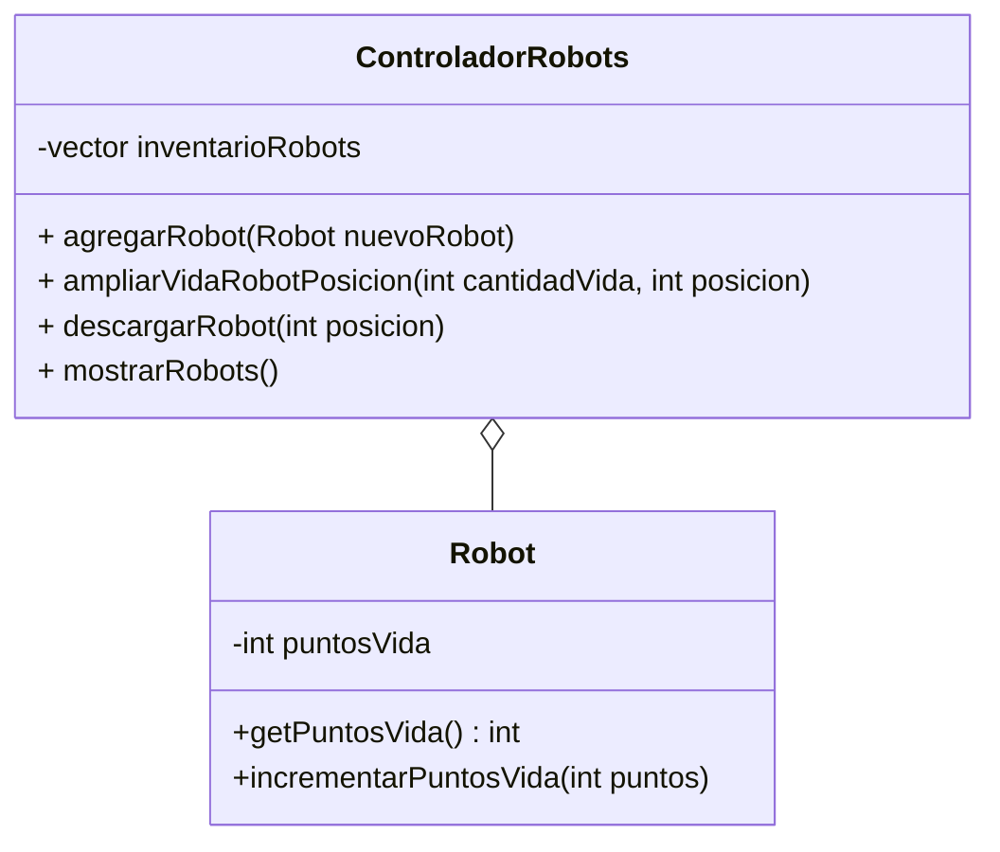

## Enunciado
La fábrica de Deepal Tech necesita un sistema para supervisar sus nuevas unidades autónomas.
Cada Robot tiene un nivel de puntos de vida que indica su estado de salud.
El sistema requiere un Controlador central que pueda registrar estas unidades,
aumentar su vida en estaciones de carga o descargarlas por completo en caso de emergencia.

## Diagrama

