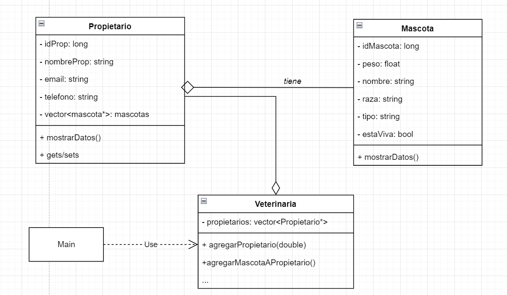

# POO Clínica veterinaria

## Objetivos

* Practicar los conceptos básicos de la POO relacionados con clases, atributos, métodos y objeto.
* Practicar el mecanismo de paso de mensajes entre objetos de una clase.
* Practicar el uso de vectores
* Practicar la interacción con un repositorio remoto GIT para agregar, modificar, eliminar archivos.

> Forma de entrega
Haga commits y push al repositorio que clonó con la asignación del parcial antes de las 12 y 30 del medio día.
## PARTE 1 - PROGRAMACIÓN ORIENTADA A OBJETOS

Usted ha sido contratado para crear un software de directorio telefónico para una compañía veterinaria del país. El área
de tecnología de la organización ya tiene definido el diseño del sistema de información. Su labor principal es
implementarlo para satisfacer los siguientes requisitos:

### Requisitos/Funcionalidades

* El sistema debe almacenar el nombre completo, email, documento de identidad y teléfono de cada persona dueña de
  mascotas
* El sistema debe almacenar la información de cada mascota. Esta información consiste en la raza, el tipo ( cadena en
  donde se escribe si es un perro, gato, conejo,etc), el peso, el nombre, la identificación (asignada
  automáticamente por el sistema) y el status: viva o muerta.
* Una persona puede tener varias mascotas y cada mascota tiene un único propietario.

La administración del sistema espera que el sistema permita:

1. [x] Agregar nuevos propietarios.
2. [x] Agregarle a un propietario una nueva mascota
3. [x] Cambiar el status de una mascota. De vida a muerta, pero no al contrario. Para ello el sistema pide el id del
   propietario responsable, y luego el id de la mascota.
4. [x] Consultar para un propietario (dado su identificación) la cantidad de mascotas muertas que tiene a cargo.

### UML

### Reglas de negocio

* Cada propietario debe estar registrado solo una vez. No pueden existir dos propietarios con el mismo número de
  identidad.

### Requisitos no funcionales

* Debe usar C++ para el desarrollo del proyecto
* En la elaboración de su programa debe considerar:
    * Uso continuo de git para mantener el histórico de avance (mínimo 3 commits) con comentarios claros sobre los
      cambios de su programa.
    * Cumplir con el estándar de codificación lowerCamelCase en el que las operaciones inician con un verbo en
      infinitivo. Las palabras compuestas inician en minúsculas y la segunda palabra tiene la primera letra en
      mayúsculas Ejm: consultarPropietarios. Las variables tienen nombres que semánticamente se relacionan con la
      función que cumplen. El cumplimiento de este estándar es obligatorio.
    * Buena indentación y organización del código.
    * Código documentado para hacerlo claro para cualquier lector. En la documentación recuerde que sus comentarios
      deben explicar por qué se hacen las cosas más que solo describir literalmente las líneas de código.
    * Buenas prácticas de programación: buen nombramiento, no números mágicos, uso de constantes.

## PARTE 2 – GIT Y GITHUB

* En la entrega del ejercicio de codificación debe evidenciar mínimo 3 commits de cada uno que evidencie el histórico de
  avance (mínimo 3 commits). Sus commits deben tener comentarios claros sobre los cambios de su programa.
* Agregue al proyecto un .gitignore. Incluya en este gitignore carpetas propias del sistema operativo que tenga su
  computador, la carpeta temporal de .IDEA que genera el IDE y las carpetas propias de la compilación del cmake.
* Elimine del repositorio el archivo eliminar.md. Ponga un comentario claro que sustente la eliminación del archivo.  La eliminación debe quedar en un commit separado al los  commits relacionados con codificación. 
* Agregue en las primeras filas del README su nombre completo, documento de identidad, código y fecha de entrega.

## PARTE 3 – SORPRÉNDEME [Opcional]
Agregue funcionalidades no solicitadas al programa. Según la dificultad de la nueva funcionalidad podría dar lugar a décimas adicionales. Las funcionalidades adicionales deben ser adicionadas al ``README`` del proyecto.
Se otorgarán máximo 0.5 décimas adicionales

## Items de evaluación
### Programación ( 27pts)
* El programa crea objetos de tipo Propietario correctamente (2pts)
* El programa crea objetos de tipo Mascota correctamente (2pts)
* Los objetos de tipo mascota son asociados a un propietario correctamente (4pts)
* El programa llama a los métodos correctos para cubrir la funcionalidad que permite consultar para un propietario (dado su identificación) la cantidad de mascotas muertas que tiene a cargo (6 pts).
* El programa llama a los métodos correctos para cambiar el status de una mascota ( 4 pts)
* No es posible cambiar el status de una mascota muerta (2 pts).
* El sistema valida que los propietarios estén registrados una sola vez (4pts)
* Las operaciones que soporta el programa están disponibles en el menú  y pueden ser probadas (3pts)

### Buenas prácticas (8 pts)
* El programa compila y corre (4 pts)
* Hay código escrito y el nuevo código cumple el estándar de codificación, esta ordenado y es legible ( 4pts)

### GIT ( 15pts)
* La entrega tiene al menos tres commits con comentarios que explican los cambios en el código fuente (4pts)
* El proyecto tiene un .gitignore configurado según lo solicitado ( 4pts)
* Es eliminado el archivo (4pts)
* Modifica el README siguiendo las instrucciones dadas (3pts)