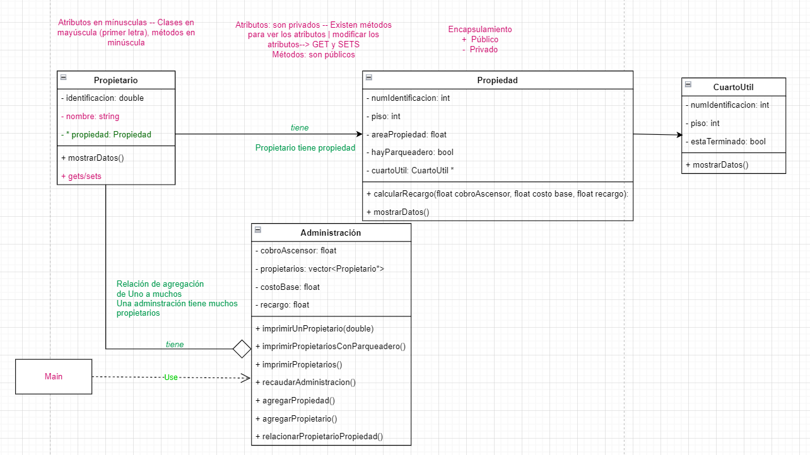

## Torres de Niza - solución completa

> > Ejercicio Codificación de clases, atributos y métodos.
> Instanciación de objetos.

> **Asignación**: Lea el siguiente enunciado e identifique en este orden: clases, atributos y métodos que abstrae el enunciado, compare con el diagrama de clases.

**Descripción**

El administrador del conjunto bosques de Niza desea contratar un software para la gestión de cobros y descuentos a
propietarios de la unidad.

Todo propietario tiene nombre, identificación y una única propiedad. Cada propiedad tiene un número de piso, un número
de identificación, un área. Algunas propiedades tienen parqueadero y otras no.

Para cada propiedad el propietario debe pagar la administración teniendo en cuenta lo siguiente:

* _Cobro por ascensor_. Vale 2000 pesos que se multiplican por el piso en el que se encuentre el apartamento.

* _El valor base_. Cada apartamento para el año 2022 paga 50 mil pesos mensuales. La tarifa podría cambiar cada año.

* _Área_. Hay un recargo del 5 por ciento sobre el valor base para los apartamentos de más de 150mts

La administración quiere:

* Conocer el valor recaudado por administración para todo el edificio.
* Imprimir para cada propietario su información nombre, identificación y piso del apartamento de su propiedad
* Imprimir la lista de propietarios de propiedades que tienen parqueadero
* Imprimir la información de un propietario dado su id
* Agregar nuevas propiedades
* Agregar nuevos propietarios
* Asociar propietarios y propiedades

A la fecha Torres de Niza tiene los siguientes propietarios:

* Debora Vilar. CC 20202492 – Apto 101 – 160mts2 Piso 10 - Parqueadero - Si
* Ignacio Rodríguez CC 30458 452 – Apto 901 – 30mts2 Piso 9 – Parqueadero - No
* Erika Muñoz CC 1058845781 – Apto 701 – 45mts2 Piso 7 - Parqueadero - Si
* Modesto Villaverde CC 31 321 432 - Apto 502 – 60 mts2 Piso 5 - Parqueadero - No

[UML - ver hoja 2 y 3 del diagrama](https://drive.google.com/file/d/1uKyTly6pnvLsX4TSfNTthTUHIbtDNFkw/view?usp=sharing)

# Exploración de CLION

* Configurar el
  IDE. [Tutorial aquí](https://www.jetbrains.com/help/clion/quick-tutorial-on-configuring-clion-on-windows.html#MinGW)
* Explorar sobre este tutorial información respecto a
    * [_Work with source code_](https://www.jetbrains.com/help/clion/working-with-source-code.html#code_folding)
    * [_Static code analysis_](https://www.jetbrains.com/help/clion/code-inspection.html)
    * Navegar por el código fuente del proyecto

# Exploración de la implementación del código fuente

* Observe las clases del código fuente
* Observe la separación entre los archivos .cpp y .h. ¿Qué tienen en común y qué tienen de diferente?
* Abra el archivo CMakeLists.txt. Investigue para qué sirve este archivo. ¿Qué archivos tiene adentro?
* Identifique los métodos privados y públicos
* ¿Para qué sirven los comentarios FIXME y TODO en el código?
* Revise el método inicializarDatos de la clase Administracion. ¿Qué hace este método?
* En qué método se calcula el recaudo total, cómo se hace.

# Extensión
El administrador del conjunto bosques de Niza lo ha contactado para solicitarle que haga una extensión al programa que usted elaboró para la administración de la propiedad. En particular el administrador le ha informado lo siguiente:

Existen propiedades que tienen cuarto útil. Este es un espacio de 2x3mts que los apartamentos usan como bodega.  A la fecha en el conjunto existen dos tipos de cuarto útil, los que están terminados y los que se encuentran en obra gris. En articular, cuando el curto útil está en obra gris esto quiere decir que los propietarios no han terminado de hacer los arreglos posibles para ese espacio. En ese caso la administración ha decidido hacer un descuento del 1% del valor a pagar en administración para favorecer que los propietarios finalicen la construcción de sus cuartos útiles. Se espera que en el futuro todos los cuartos útiles estén totalmente terminados.  Cada cuarto útil tiene una numeración y el número de piso en el que se encuentra.
Además de los reportes pedidos en la primera parte de este trabajo, el administrador ahora quiere saber:
* El nombre de los propietarios cuyas propiedades no tienen cuarto útil
* El nombre de los propietarios cuyas propiedades si tienen cuarto útil y están terminadas.
* El número de los apartamentos que si tienen cuarto útil pero no están terminados.

A la fecha Torres de Niza tiene los siguientes propietarios:
* Debora Vilar. CC 20202492 – Apto 101 – 160mts2 Piso 10 - Parqueadero – Si – Cuarto útil no terminado en el piso 2. Numeración A201
* Ignacio Rodríguez CC 30458 452 – Apto 901 – 30mts2 Piso 9 – Parqueadero – No - Cuarto útil terminado en el piso 2. Numeración A202
* Erika Muñoz CC 1058845781 – Apto 701 – 45mts Piso 7 - Parqueadero – Si - Cuarto útil terminado en el piso 2. Numeración A203
* Modesto Villaverde CC 31 321 432 - Apto 502 – 60 mts Piso 5 - Parqueadero – No – No tiene cuarto útil. 

